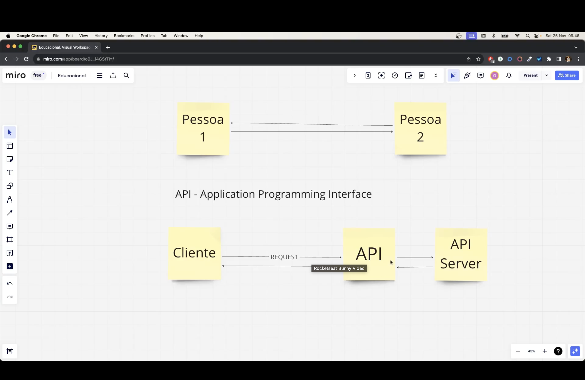
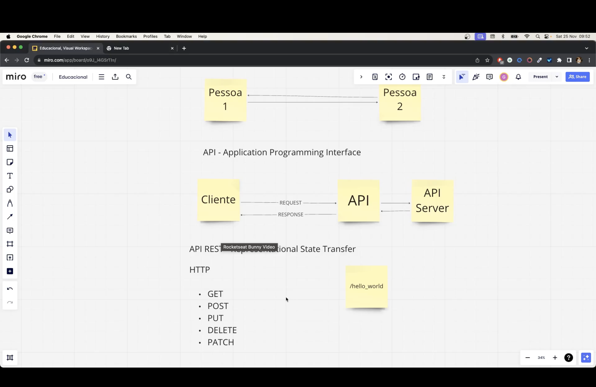
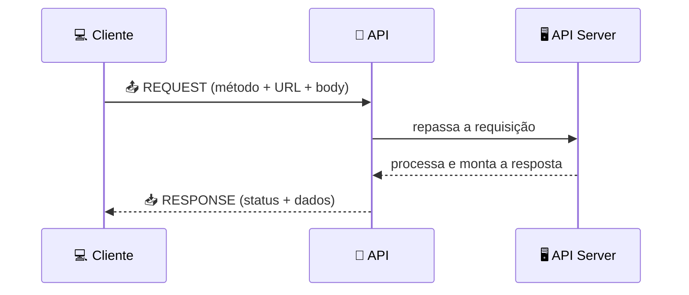
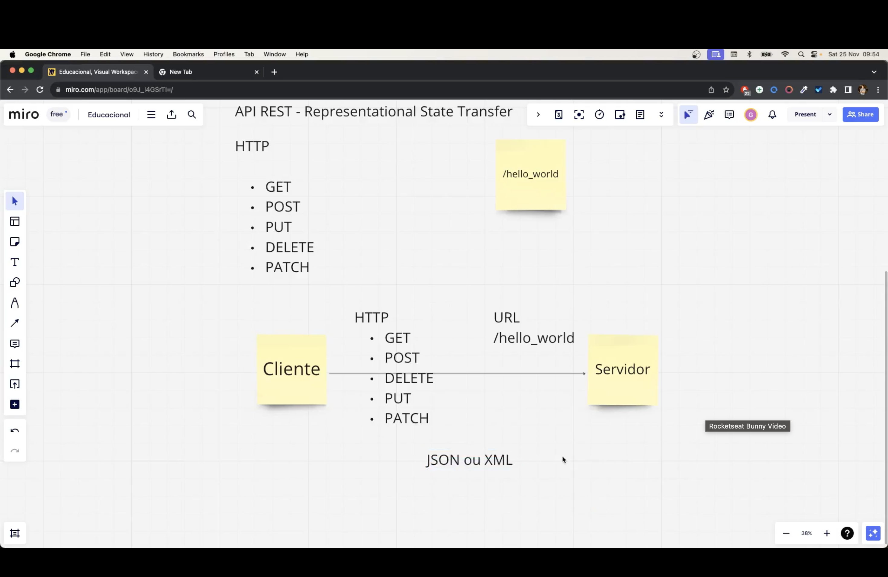
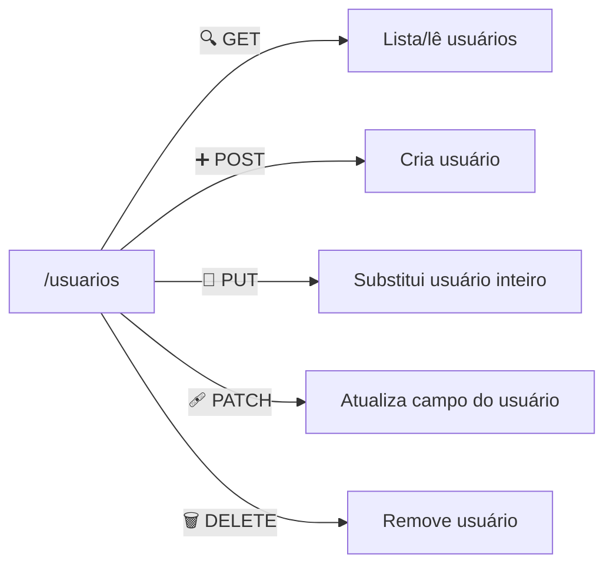
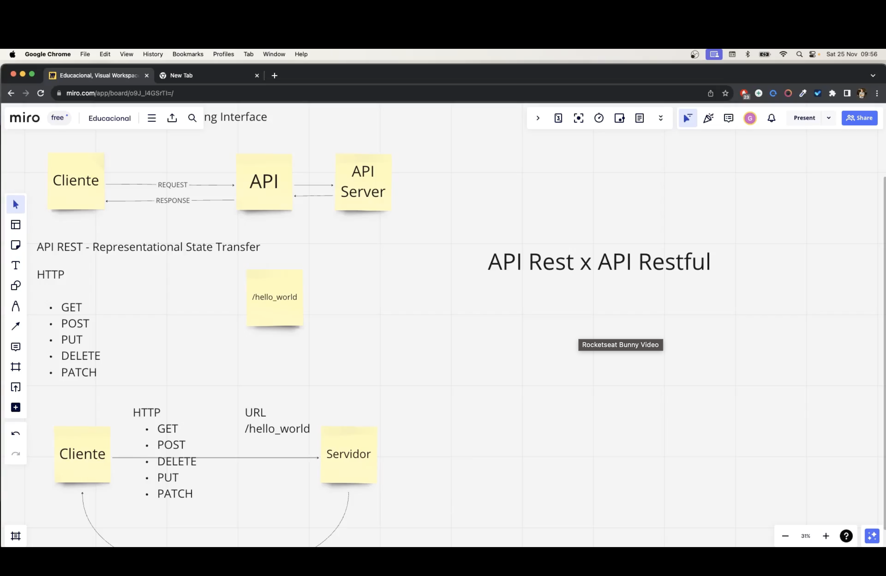
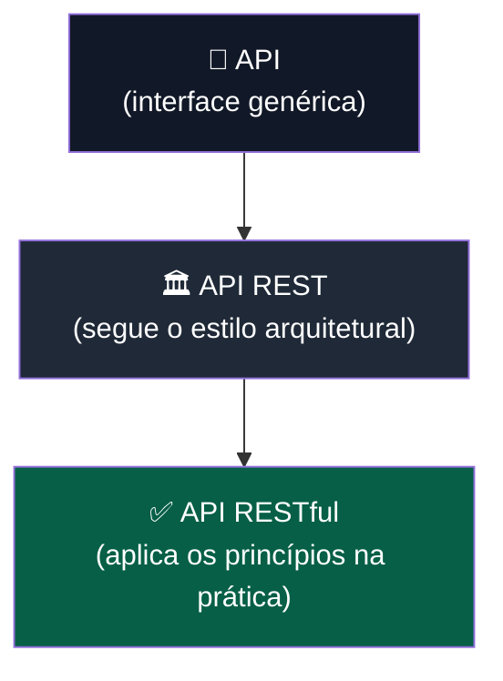

<h1 align="center">🔌 Aula 70 — Conceitos Básicos de API e API REST</h1>

  
  
  
  
  

## 📌 O que é uma API?

**API** = **A**pplication **P**rogramming **Interface** (Interface de Programação de Aplicações).

É um conjunto de regras que permite que **dois sistemas diferentes conversem entre si** — sem que um precise conhecer os detalhes internos do outro. Funciona como um "garçom": o **cliente** faz um pedido (request), a API leva esse pedido até o **servidor**, que devolve a resposta (response).

> 🗣️ Analogia: assim como duas pessoas trocam mensagens usando uma linguagem em comum, dois sistemas trocam dados usando uma API como intermediária.

---

## 🔄 Como funciona: Request e Response

| Termo | Ícone | Descrição |
| :--- | :---: | :--- |
| **Cliente** | 💻 | Quem faz a solicitação (navegador, app mobile, outro sistema) |
| **Request** | 📤 | A requisição enviada ao servidor (método + URL + dados) |
| **API** | 🔌 | A "porta de entrada" que recebe e roteia a requisição |
| **API Server** | 🖥️ | Onde a lógica de negócio processa o pedido |
| **Response** | 📥 | A resposta devolvida ao cliente (status + dados) |

---

## 🌐 Métodos HTTP

Os **verbos HTTP** indicam a *intenção* da requisição — o que o cliente quer fazer com o recurso apontado pela URL.

| Verbo | Ícone | Ação | Exemplo |
| :--- | :---: | :--- | :--- |
|  | 🔍 | Buscar/ler um recurso | `GET /usuarios` |
|  | ➕ | Criar um novo recurso | `POST /usuarios` |
|  | 🔁 | Substituir um recurso inteiro | `PUT /usuarios/1` |
|  | 🩹 | Atualizar parte de um recurso | `PATCH /usuarios/1` |
|  | 🗑️ | Remover um recurso | `DELETE /usuarios/1` |

Anatomia de uma requisição, usando `/hello_world` como rota de exemplo:

| Parte | Exemplo | Papel |
| :--- | :--- | :--- |
| 🌐 URL | `http://127.0.0.1:5000/hello_world` | Endereço do recurso |
| 🔤 Método | `GET` | Ação desejada |
| 📦 Corpo (body) | `{"nome": "Lucas"}` | Dados enviados (POST/PUT/PATCH) |
| 📨 Formato | `JSON` ou `XML` | Como os dados são estruturados |

---

## 🆚 API REST x API RESTful

**REST** = **RE**presentational **S**tate **T**ransfer (Transferência de Estado Representacional). É um **estilo arquitetural** — um conjunto de boas práticas para projetar APIs — proposto por Roy Fielding em 2000.

| Conceito | Definição |
| :--- | :--- |
| 🏛️ **API REST** | O *estilo*/conjunto de princípios (stateless, uso correto de verbos HTTP, recursos identificados por URL, etc.) |
| ✅ **API RESTful** | Uma API que **segue de fato** os princípios REST na prática |

> 💡 Toda API RESTful é REST, mas nem toda API que se diz "REST" cumpre 100% dos princípios — por isso o termo **RESTful** existe para reforçar a aderência real às regras.

### 🧱 Princípios REST

| Princípio | Descrição |
| :--- | :--- |
| 🚫 **Stateless** | O servidor não guarda estado entre requisições — cada request é independente |
| 📍 **Recursos via URL** | Cada entidade (usuário, produto...) tem uma URL própria (`/usuarios/1`) |
| 🔤 **Verbos HTTP corretos** | GET para ler, POST para criar, etc. — sem misturar responsabilidades |
| 📨 **Representação de dados** | Os dados trafegam em formatos padronizados, geralmente `JSON` |
| 🔗 **Interface uniforme** | Mesmo padrão de acesso para todos os recursos da API |

---

## 🔀 API REST x API comum — diferenças

| | 🔌 API (genérica) | 🏛️ API REST |
| :--- | :--- | :--- |
| **Definição** | Qualquer interface que permite comunicação entre sistemas | API que segue os princípios arquiteturais REST |
| **Protocolo** | Pode usar qualquer protocolo (SOAP, RPC, GraphQL, HTTP...) | Usa **HTTP** como protocolo de transporte |
| **Estado** | Pode manter estado entre chamadas (*stateful*) | É **stateless** por definição |
| **Formato de dados** | Livre (XML, binário, texto...) | Geralmente `JSON`, também aceita `XML` |
| **Estrutura de URL** | Sem convenção fixa | Recursos identificados por URLs (`/recurso/id`) |

---

## ✅ Resumo

- **API** conecta dois sistemas (cliente ↔ servidor) por meio de **requests** e **responses**.
- Os **métodos HTTP** (`GET`, `POST`, `PUT`, `PATCH`, `DELETE`) definem a intenção de cada requisição.
- **REST** é o estilo arquitetural; **RESTful** é a API que realmente segue esse estilo.
- Dados normalmente trafegam em **JSON**.
