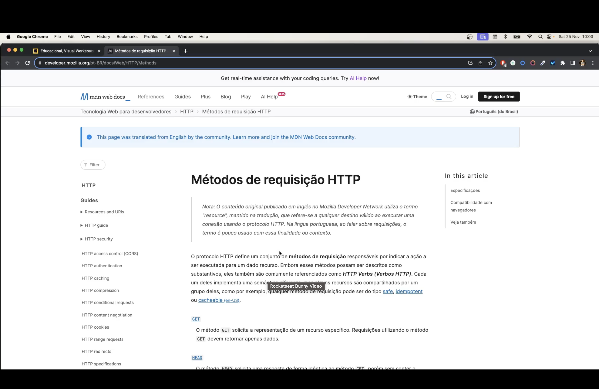
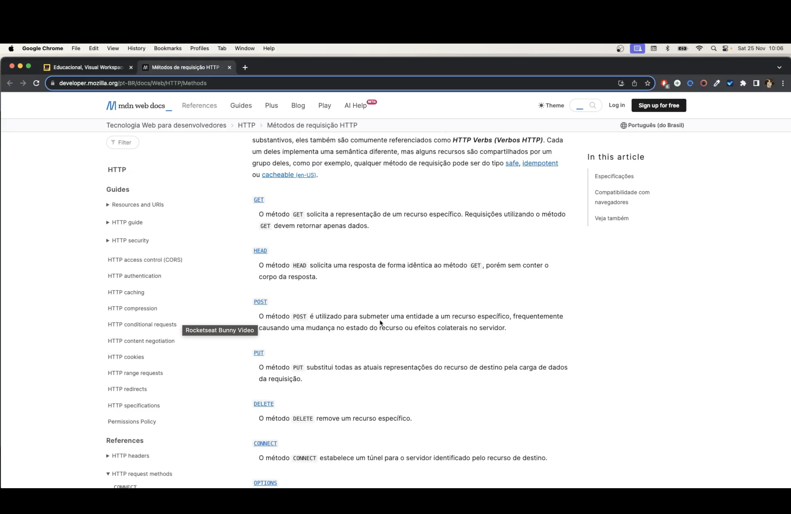
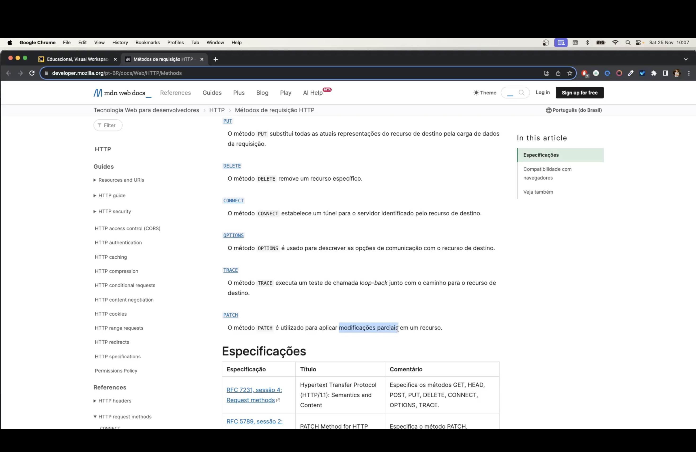
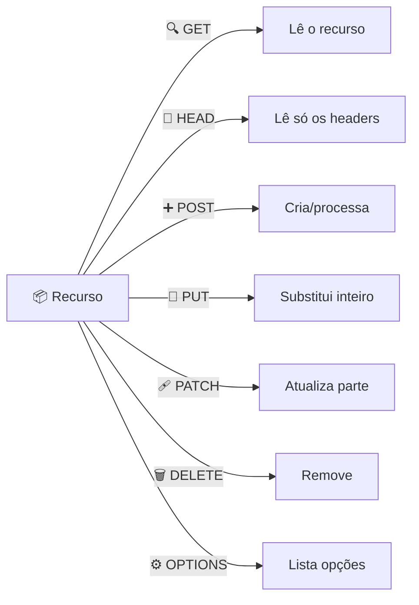

<h1 align="center">📡 Aula 71 — Métodos de Requisição HTTP</h1>

  
  
  
  
  

## 📌 O que são métodos de requisição

O protocolo **HTTP** define um conjunto de **métodos de requisição** (também chamados de **HTTP Verbs**) responsáveis por indicar a *ação* a ser executada sobre um recurso. Cada método implementa uma semântica diferente, mas todos compartilham três propriedades possíveis:

| Propriedade | Significado |
| :--- | :--- |
| 🛡️ **Safe** | Não altera o estado do recurso no servidor (apenas leitura) |
| 🔁 **Idempotent** | Repetir a mesma requisição várias vezes tem o mesmo efeito que fazê-la uma única vez |
| 💾 **Cacheable** | A resposta pode ser armazenada em cache para reuso |

> 📚 Fonte: [MDN Web Docs — Métodos de requisição HTTP](https://developer.mozilla.org/pt-BR/docs/Web/HTTP/Methods)

---

## 🔤 Os métodos HTTP

| Método | Ícone | Safe | Idempotent | Cacheable | Descrição |
| :--- | :---: | :---: | :---: | :---: | :--- |
| `GET` | 🔍 | ✅ | ✅ | ✅ | Solicita a representação de um recurso específico. Deve retornar apenas dados. |
| `HEAD` | 👀 | ✅ | ✅ | ✅ | Solicita uma resposta idêntica ao `GET`, porém sem o corpo da resposta. |
| `POST` | ➕ | ❌ | ❌ | ⚠️ | Submete uma entidade a um recurso, geralmente causando mudança de estado ou efeitos colaterais no servidor. |
| `PUT` | 🔁 | ❌ | ✅ | ❌ | Substitui **todas** as representações atuais do recurso pelos dados enviados na requisição. |
| `DELETE` | 🗑️ | ❌ | ✅ | ❌ | Remove um recurso específico. |

---

## 🧰 Métodos complementares

| Método | Ícone | Safe | Idempotent | Cacheable | Descrição |
| :--- | :---: | :---: | :---: | :---: | :--- |
| `CONNECT` | 🔌 | ❌ | ❌ | ❌ | Estabelece um túnel para o servidor identificado pelo recurso de destino. |
| `OPTIONS` | ⚙️ | ✅ | ✅ | ❌ | Descreve as opções de comunicação disponíveis para o recurso de destino. |
| `TRACE` | 📍 | ✅ | ✅ | ❌ | Executa um teste de chamada *loop-back* junto com o caminho até o recurso de destino. |
| `PATCH` | 🩹 | ❌ | ❌ | ⚠️ | Aplica modificações **parciais** em um recurso, ao contrário do `PUT`, que substitui tudo. |

---

## 🆚 `PUT` x `PATCH`

Os dois métodos atualizam um recurso, mas com diferença importante:

| | 🔁 `PUT` | 🩹 `PATCH` |
| :--- | :--- | :--- |
| **Escopo** | Substitui o recurso **inteiro** | Atualiza **apenas** os campos enviados |
| **Idempotente** | ✅ Sim | ❌ Não necessariamente |
| **Exemplo** | `PUT /usuarios/1` com o objeto completo | `PATCH /usuarios/1` com `{"nome": "Lucas"}` |

---

## ✅ Resumo

- Os **métodos HTTP** (`GET`, `HEAD`, `POST`, `PUT`, `DELETE`, `CONNECT`, `OPTIONS`, `TRACE`, `PATCH`) definem a ação sobre um recurso.
- Todo método pode ser classificado quanto a ser **safe**, **idempotent** e/ou **cacheable**.
- `GET`/`HEAD` apenas leem; `POST` cria; `PUT` substitui inteiro; `PATCH` atualiza parte; `DELETE` remove.
- `OPTIONS`, `TRACE` e `CONNECT` são métodos auxiliares/de diagnóstico, menos usados no dia a dia de uma API REST.
