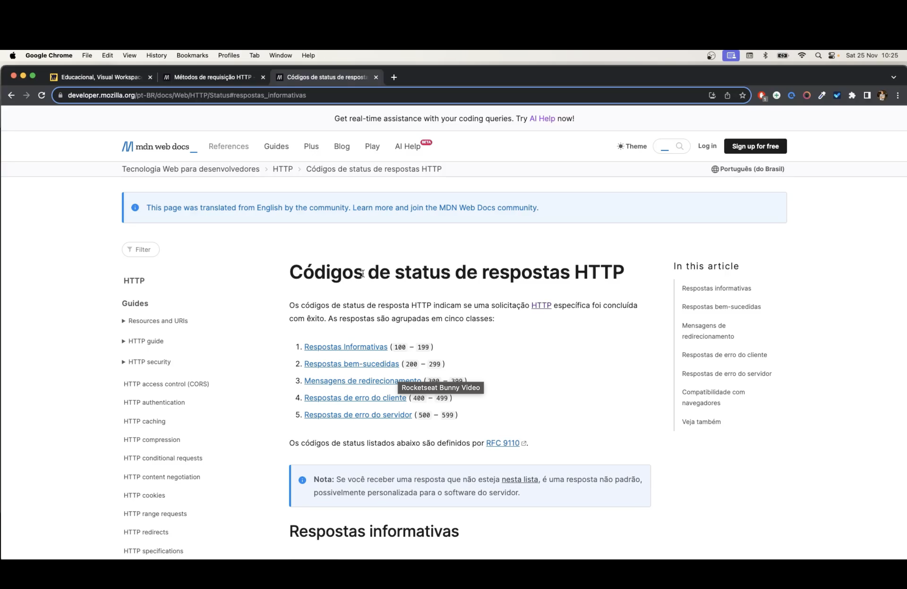
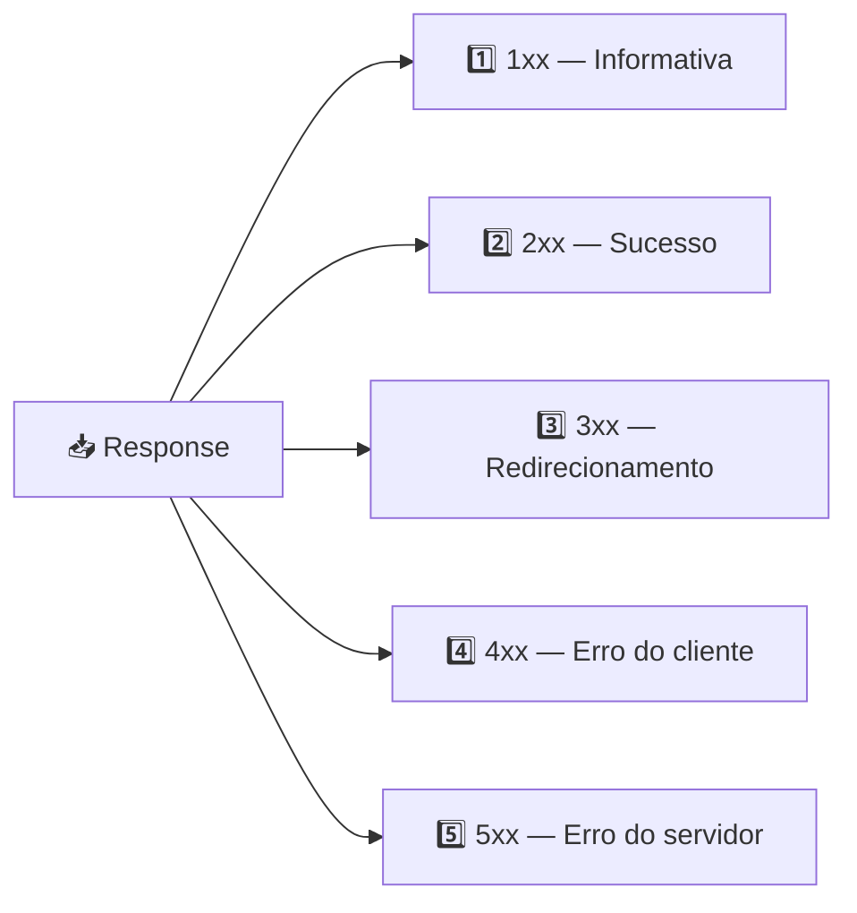
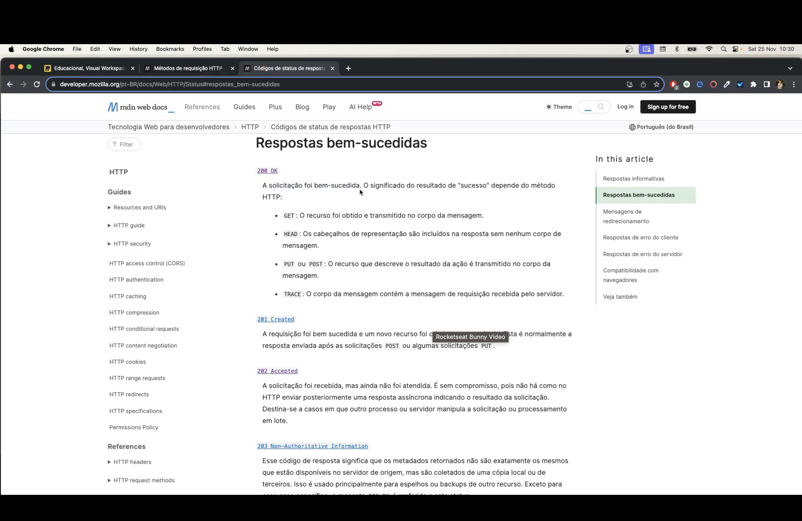
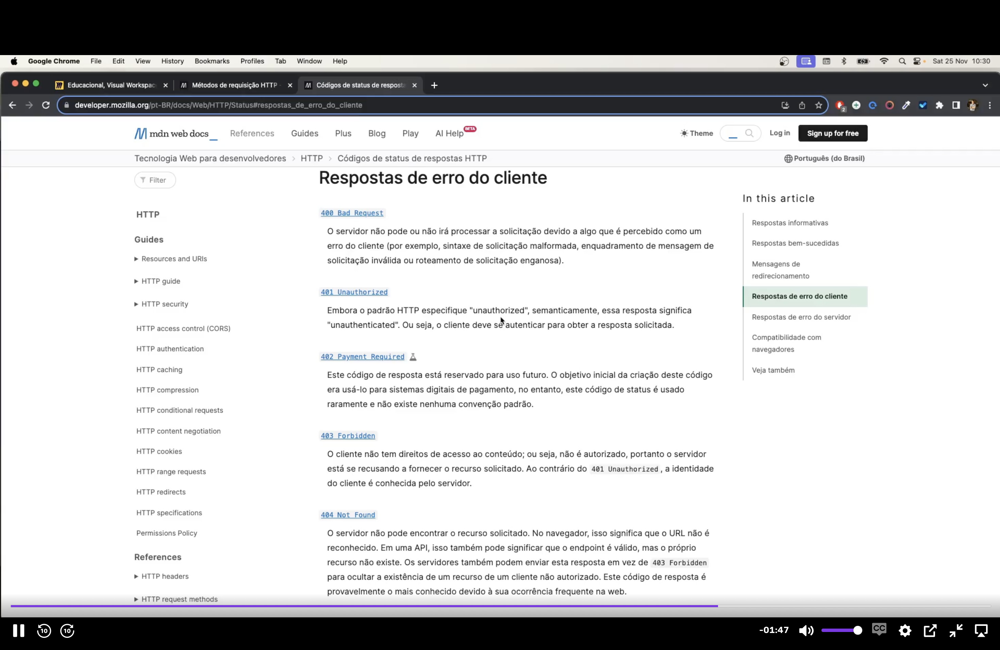
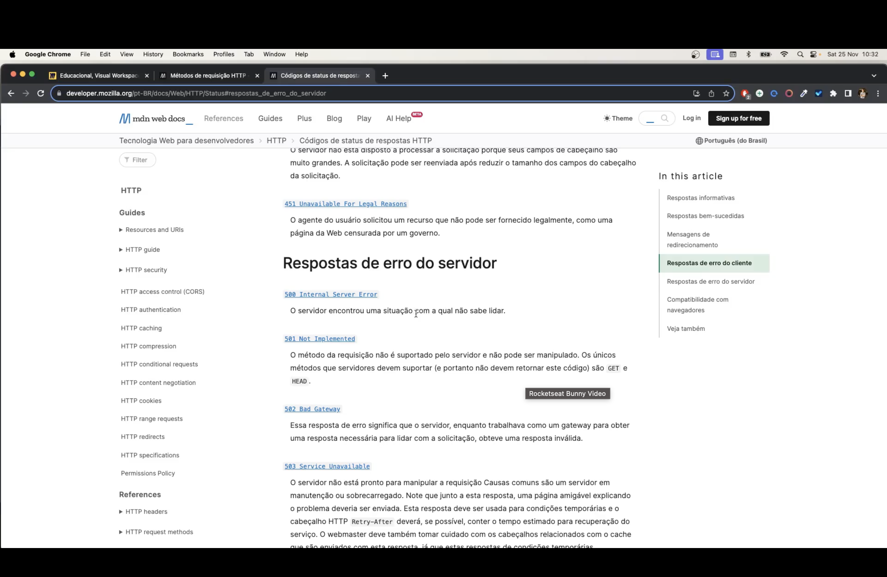

<h1 align="center">📶 Aula 72 — Código de Resposta HTTP</h1>

  
  
  
  
  

## 📌 O que são códigos de status

Os **códigos de status HTTP** indicam se uma requisição foi concluída com êxito — e, quando não foi, o motivo. Todo `Response` retornado por um servidor carrega um código numérico de 3 dígitos, agrupado em **5 classes**:

| Classe | Faixa | Significado |
| :--- | :--- | :--- |
| 1️⃣ | `100 – 199` | Informativas |
| 2️⃣ | `200 – 299` | Sucesso |
| 3️⃣ | `300 – 399` | Redirecionamento |
| 4️⃣ | `400 – 499` | Erro do cliente |
| 5️⃣ | `500 – 599` | Erro do servidor |

> 📚 Fonte: [MDN Web Docs — Códigos de status de respostas HTTP](https://developer.mozilla.org/pt-BR/docs/Web/HTTP/Status)

---

## ✅ 2xx — Respostas de sucesso

| Código | Ícone | Nome | Descrição |
| :--- | :---: | :--- | :--- |
| `200` | ✅ | OK | A solicitação foi bem-sucedida (uso mais comum, resposta de `GET`) |
| `201` | ➕ | Created | Um novo recurso foi criado — resposta típica de `POST` |
| `202` | ⏳ | Accepted | A solicitação foi recebida, mas ainda não foi processada |
| `203` | ℹ️ | Non-Authoritative Information | Os dados retornados vieram de uma cópia/espelho, não da origem |

---

## 🚫 4xx — Erros do cliente

| Código | Ícone | Nome | Descrição |
| :--- | :---: | :--- | :--- |
| `400` | ❌ | Bad Request | A sintaxe da requisição está malformada |
| `401` | 🔒 | Unauthorized | O cliente precisa se autenticar para obter a resposta |
| `403` | ⛔ | Forbidden | O cliente é conhecido, mas não tem permissão de acesso |
| `404` | 🔍 | Not Found | O recurso solicitado não existe |
| `451` | ⚖️ | Unavailable For Legal Reasons | O recurso foi bloqueado por motivos legais |

> 💡 `401` x `403`: em ambos o acesso é negado, mas no `401` o cliente **não está autenticado**, enquanto no `403` a identidade é conhecida e **mesmo assim não tem permissão**.

---

## 💥 5xx — Erros do servidor

| Código | Ícone | Nome | Descrição |
| :--- | :---: | :--- | :--- |
| `500` | 💥 | Internal Server Error | O servidor encontrou uma situação inesperada com a qual não sabe lidar |
| `501` | 🚧 | Not Implemented | O método da requisição não é suportado pelo servidor |
| `502` | 🌉 | Bad Gateway | O servidor, atuando como gateway, recebeu uma resposta inválida do servidor de origem |
| `503` | 🛠️ | Service Unavailable | O servidor está indisponível (sobrecarga ou manutenção) |

---

## 🆚 Erro do cliente x Erro do servidor

| | 4️⃣ `4xx` | 5️⃣ `5xx` |
| :--- | :--- | :--- |
| **Origem do problema** | Na requisição enviada pelo cliente | No processamento do servidor |
| **Quem deve corrigir** | O cliente (ajustar a requisição) | O servidor/desenvolvedor da API |
| **Exemplo comum** | `404 Not Found`, `401 Unauthorized` | `500 Internal Server Error` |

---

## ✅ Resumo

- Todo `Response` HTTP carrega um **código de status** de 3 dígitos, agrupado em 5 classes.
- `1xx` informa, `2xx` confirma sucesso, `3xx` redireciona, `4xx` aponta erro do cliente, `5xx` aponta erro do servidor.
- `200 OK` e `201 Created` são as respostas de sucesso mais comuns em uma API REST.
- `404 Not Found` e `401`/`403` são os erros de cliente mais frequentes; `500 Internal Server Error` é o erro de servidor mais genérico.
