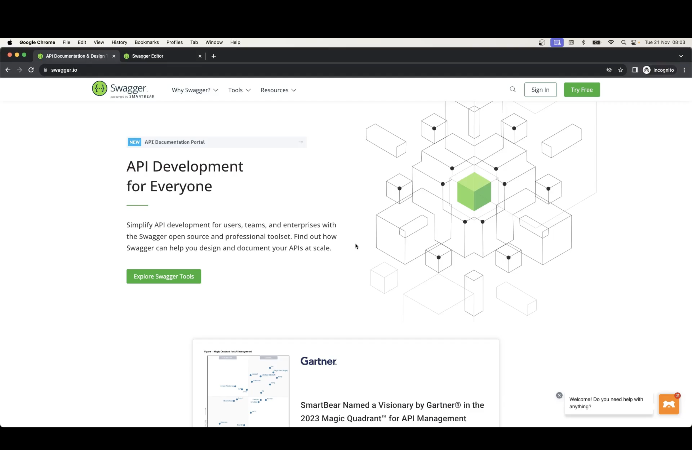
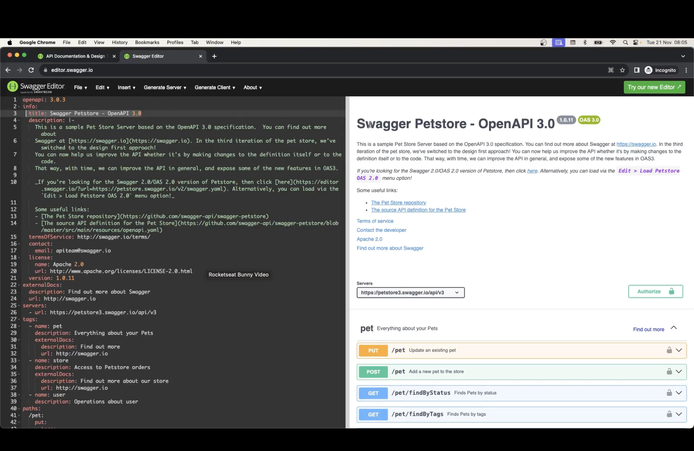
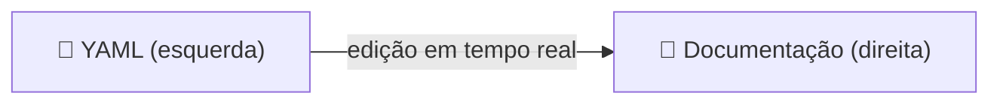
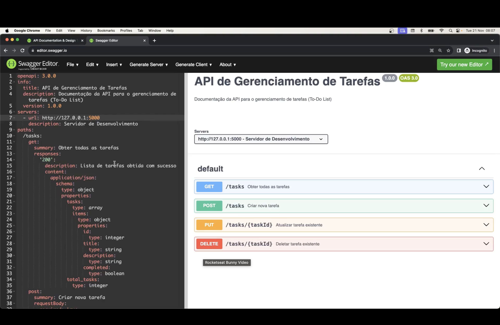
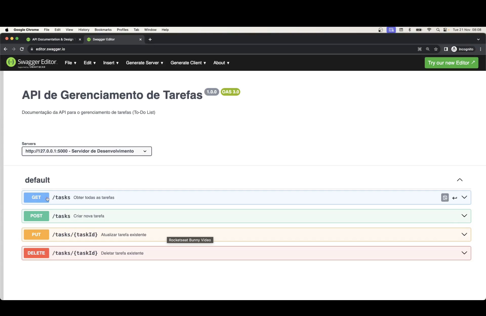
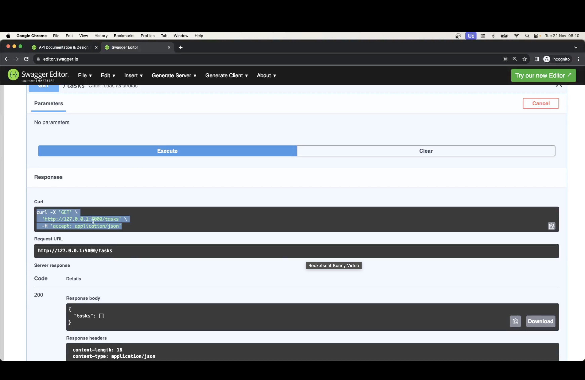
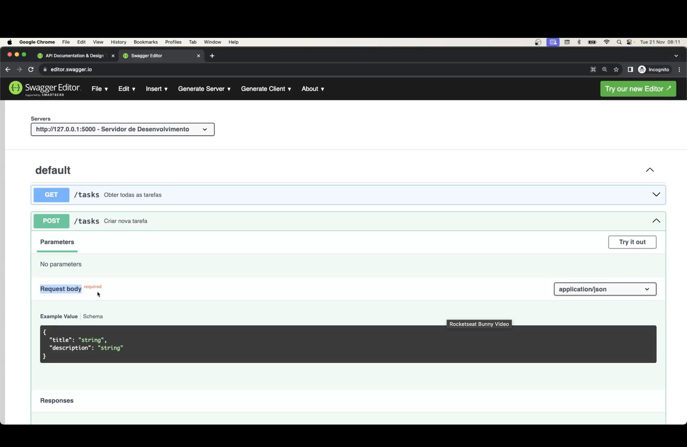
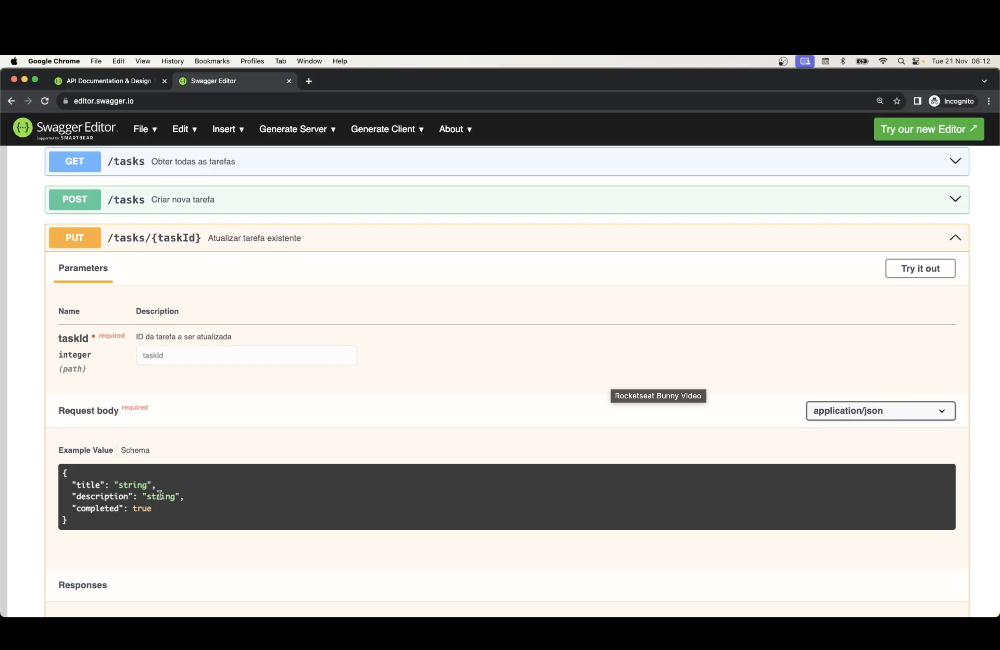
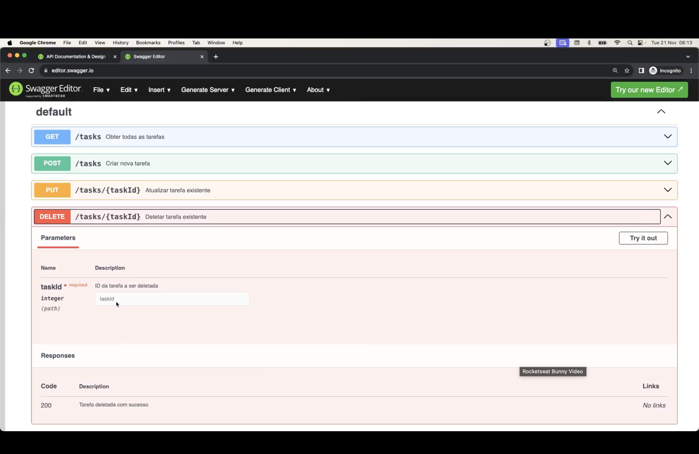

<h1 align="center">📄 Aula 73 — Documentação de API com Swagger</h1>

<p align="center">
  
  
  
  
  
</p>

## 📌 Por que documentar uma API

Uma API sem documentação obriga quem for consumi-la a **ler o código-fonte** para descobrir rotas, métodos e formatos aceitos. O **Swagger** resolve isso: é um conjunto de ferramentas construído em torno da especificação **OpenAPI**, que descreve uma API em um único arquivo (YAML ou JSON) — e transforma esse arquivo em uma documentação interativa.

<p align="center"></p>

| Termo | O que é |
| :--- | :--- |
| 📐 **OpenAPI** | A *especificação* — o formato/padrão do arquivo que descreve a API |
| 🧰 **Swagger** | O *conjunto de ferramentas* (Editor, UI, Codegen) que lê essa especificação |
| 📄 `openapi.yml` | O arquivo, escrito no padrão OpenAPI, com as rotas, métodos e schemas da API |

> 🔗 **Link do Swagger**: cole o conteúdo de [`openapi.yml`](./openapi.yml) em **https://editor.swagger.io** para visualizar a documentação renderizada lado a lado com o YAML.

---

## 🧰 Swagger Editor

<p align="center"></p>

O **Swagger Editor** ([editor.swagger.io](https://editor.swagger.io)) abre com um exemplo padrão (o "Swagger Petstore"): à esquerda fica o YAML da especificação, à direita a documentação já renderizada, atualizada em tempo real a cada edição.



---

## 📝 Escrevendo o `openapi.yml` do projeto

Substituindo o exemplo padrão pela especificação da nossa **API de Gerenciamento de Tarefas**, o Swagger Editor renderiza automaticamente as rotas `/tasks` e `/tasks/{taskId}`:

<p align="center"></p>

<p align="center"></p>

```yaml
paths:
  /tasks:
    get:
      summary: Obter todas as tarefas
      responses:
        "200":
          description: Lista de tarefas obtida com sucesso
```

| Bloco | Papel |
| :--- | :--- |
| `info` | Metadados da API: nome, versão, descrição |
| `servers` | Uma ou mais URLs onde a API está disponível |
| `paths` | Cada rota (`/tasks`, `/tasks/{taskId}`...) e seus métodos (`get`, `post`, `put`, `delete`) |
| `components.schemas` | Modelos de dados reutilizados no corpo das requisições/respostas (`Task`) |

---

## ▶️ Testando as rotas direto pelo Swagger

O Swagger Editor não só documenta — ele também **executa** as requisições contra o servidor rodando localmente (`http://127.0.0.1:5000`), através do botão **Try it out**.

### `GET /tasks`

<p align="center"></p>

Ao clicar em **Execute**, o Swagger monta o `curl` correspondente, envia a requisição e mostra a *Request URL*, o código de status e o corpo da resposta.

### `POST /tasks`

<p align="center"></p>

Rotas com corpo de requisição exibem um **Example Value** editável — o formato esperado (`title`, `description`) já vem preenchido a partir do `schema` definido no YAML.

### `PUT /tasks/{taskId}`

<p align="center"></p>

Parâmetros de rota (`taskId`) aparecem em um campo próprio, separados do corpo da requisição — reflexo direto do `parameters: in: path` na especificação.

### `DELETE /tasks/{taskId}`

<p align="center"></p>

---

## ✅ Resumo

- **OpenAPI** é a especificação; **Swagger** é o conjunto de ferramentas que a interpreta.
- Um arquivo `openapi.yml` organiza a API em `info`, `servers`, `paths` e `components.schemas`.
- Colar o `openapi.yml` em **https://editor.swagger.io** gera a documentação interativa sem precisar rodar o servidor.
- O botão **Try it out** permite testar cada rota (`GET`, `POST`, `PUT`, `DELETE`) contra o servidor real, direto pela documentação.
