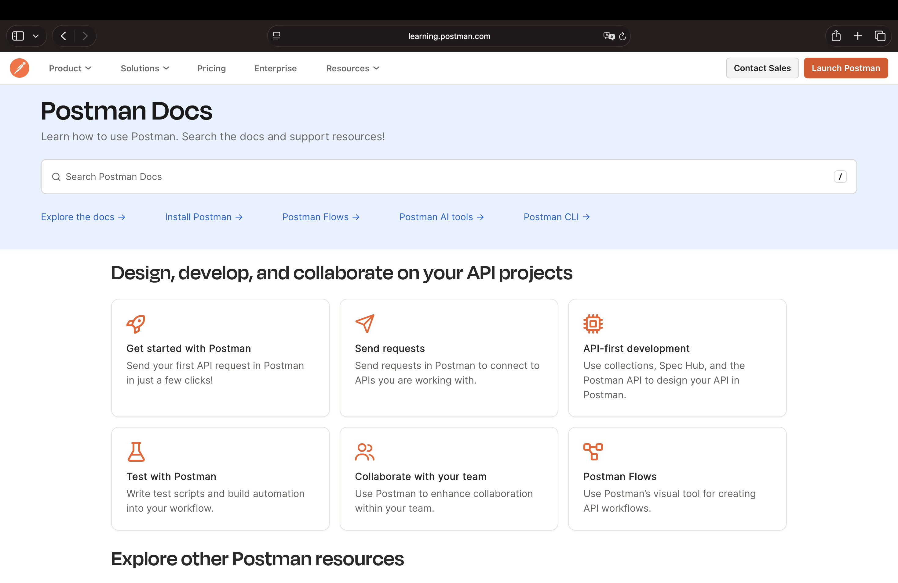
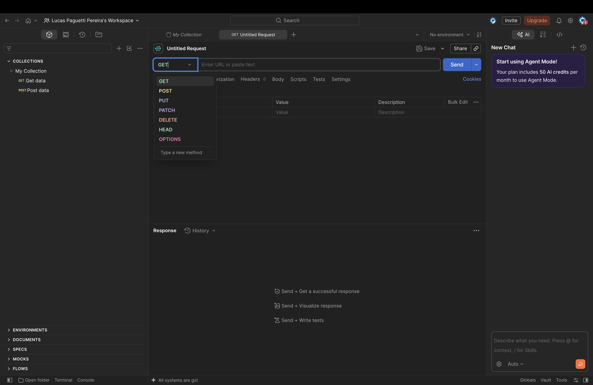
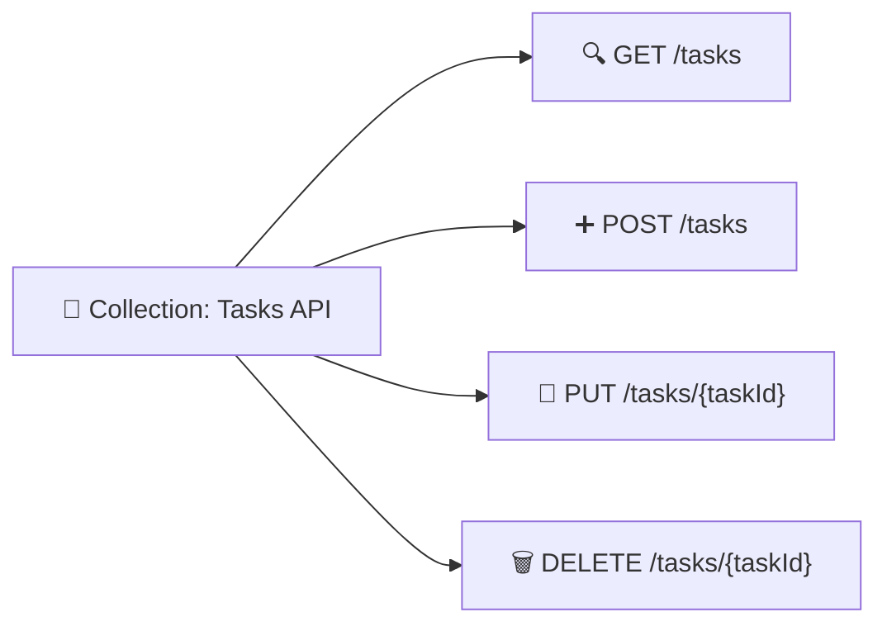

<h1 align="center">📬 Aula 74 — Testes de API com o Postman</h1>

  
  
  
  
  

<h2 align="left">📌 O que é o Postman?</h2>

Enquanto o **Swagger** documenta e testa uma API a partir da sua especificação, o **Postman** é uma ferramenta dedicada a montar, salvar e organizar requisições HTTP manualmente — sem depender de um arquivo `openapi.yml`. Cada requisição define um **método**, uma **URL**, e opcionalmente **headers**, **corpo** e **testes automatizados**.

| Elemento da interface | Papel |
| :--- | :--- |
| 📁 **Collections** | Pastas que agrupam requisições relacionadas (ex.: todas as rotas de `/tasks`) |
| 🔀 **Método** | Dropdown com `GET`, `POST`, `PUT`, `PATCH`, `DELETE`, `HEAD`, `OPTIONS` |
| 🌐 **URL** | Endereço do endpoint a ser chamado |
| 📑 **Headers / Body / Tests** | Abas para configurar cabeçalhos, corpo da requisição e scripts de verificação |
| 📥 **Response** | Painel inferior com status, tempo, tamanho e corpo da resposta |

---

## 🧱 Organizando em Collections

Antes de testar, cria-se uma **Collection** para agrupar as requisições da API de Gerenciamento de Tarefas — cada rota do `openapi.yml` vira uma requisição salva dentro dela, evitando redigitar método e URL a cada teste.

---

## ▶️ Testando as rotas da API de Tarefas

Com o servidor Flask rodando em `http://127.0.0.1:5000`, cada rota é testada trocando o método no dropdown e preenchendo a URL:

| Requisição | Método | URL | Corpo (Body → raw → JSON) |
| :--- | :---: | :--- | :--- |
| Listar tarefas | `GET` | `/tasks` | — |
| Criar tarefa | `POST` | `/tasks` | `{"title": "Estudar Postman", "description": "..."}` |
| Buscar por ID | `GET` | `/tasks/1` | — |
| Atualizar tarefa | `PUT` | `/tasks/1` | `{"title": "...", "completed": true}` |
| Remover tarefa | `DELETE` | `/tasks/1` | — |

Ao clicar em **Send**, o painel **Response** mostra o código de status (`200`, `201`, `404`...), o tempo de resposta e o JSON retornado — permitindo validar visualmente o comportamento de cada rota sem precisar de `curl` ou do navegador.

---

## 🆚 Swagger x Postman

| | 📖 Swagger | 📬 Postman |
| :--- | :--- | :--- |
| **Origem das requisições** | Gerada a partir do `openapi.yml` | Montada manualmente pelo usuário |
| **Serve como documentação** | ✅ Sim, é o propósito principal | ❌ Não é seu foco |
| **Organização** | Uma página por especificação | Collections com múltiplas requisições salvas |
| **Testes automatizados** | Limitado | Aba **Tests**, com scripts em JavaScript |

---

## ✅ Resumo

- O **Postman** monta, salva e organiza requisições HTTP em **Collections**, sem depender de uma especificação como o `openapi.yml`.
- Cada requisição define método, URL, headers e corpo — e o painel **Response** mostra status, tempo e corpo da resposta.
- As rotas da API de Tarefas (`GET`, `POST`, `PUT`, `DELETE` em `/tasks`) podem ser testadas trocando apenas o método e a URL.
- Diferente do Swagger, o Postman não documenta a API a partir de uma especificação — ele é uma ferramenta de teste manual e reutilizável.
