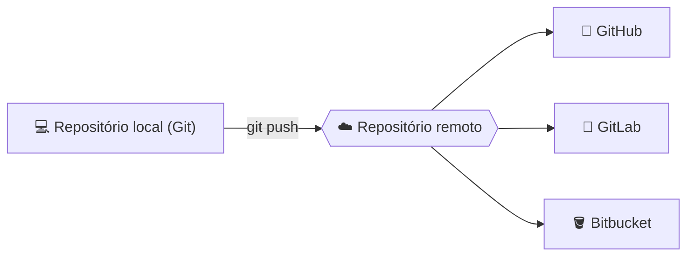

<h1 align="center">🔀 Aula 75 — Git, GitHub x GitLab x Bitbucket</h1>

  
  
  
  
  
  

## 📌 O que é o Git?

**Git** é um **sistema de controle de versão** (VCS): uma ferramenta de linha de comando que registra o histórico de alterações de um projeto em *commits*, permitindo voltar a qualquer ponto anterior, comparar mudanças e trabalhar em paralelo através de *branches*. Ele roda **localmente**, na própria máquina — não depende de internet nem de nenhuma plataforma para existir.

| Comando | Papel |
| :--- | :--- |
| `git init` | Transforma uma pasta comum em um repositório Git |
| `git add` | Move alterações para a *staging area* |
| `git commit` | Registra as alterações no histórico do repositório |
| `git status` / `git log` | Mostra o estado atual e o histórico de commits |
| `git branch` / `git checkout` | Cria e alterna entre linhas de desenvolvimento paralelas |
| `git clone` / `git push` / `git pull` | Sincronizam o repositório local com um **remoto** |

## 🌐 GitHub, GitLab e Bitbucket

Git não tem interface web nem guarda nada "na nuvem" por conta própria — é aí que entram **GitHub**, **GitLab** e **Bitbucket**: plataformas que hospedam repositórios Git remotamente e adicionam recursos em volta dele, como interface visual, controle de acesso, Pull/Merge Requests, Issues e integração com CI/CD.

| | 🐙 GitHub | 🦊 GitLab | 🪣 Bitbucket |
| :--- | :--- | :--- | :--- |
| **Empresa** | Microsoft | GitLab Inc. | Atlassian |
| **Termo para revisão de código** | Pull Request | Merge Request | Pull Request |
| **CI/CD nativo** | GitHub Actions | GitLab CI/CD (pioneiro no recurso) | Bitbucket Pipelines |
| **Diferencial** | Maior comunidade open source | Pode ser auto-hospedado (self-managed) | Integração forte com Jira e Trello |

> 📌 Este repositório já está hospedado no **GitHub** — os comandos `git clone`, `git add`, `git commit` e `git push` usados ao longo do curso são o Git puro; é o GitHub que guarda o remoto e exibe esse histórico na web.

## ✅ Resumo

- **Git** é a ferramenta de controle de versão que roda localmente e registra o histórico em commits.
- **GitHub**, **GitLab** e **Bitbucket** são plataformas que hospedam repositórios Git remotamente, cada uma com sua própria interface, CI/CD e termo para revisão de código (Pull/Merge Request).
- Elas competem entre si na hospedagem, mas todas usam o mesmo Git por baixo dos panos.
- Este projeto já é um repositório Git versionado e hospedado no GitHub.