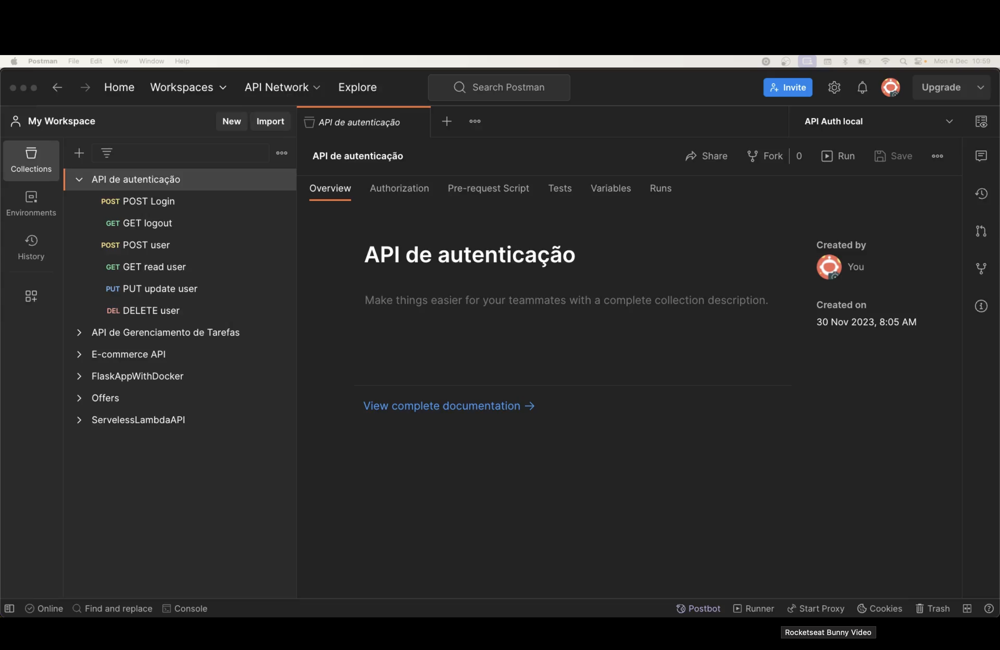
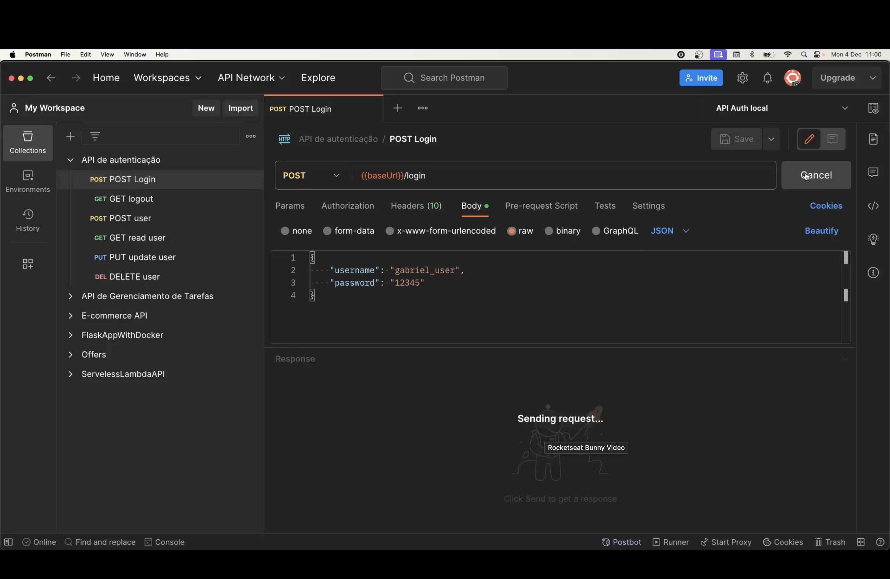
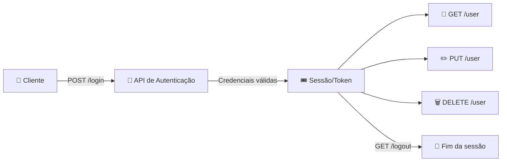

<h1 align="center">🚀 Aula 92 — Apresentando o Projeto</h1>

  
  
  
  

<h2 align="left">📌 O desafio do Desenvolvimento Avançado com Flask</h2>

Encerrado o módulo básico (CRUD, HTTP, Swagger e Postman), o módulo **Desenvolvimento Avançado com Flask** parte para um projeto maior: uma **API de autenticação**, com cadastro, login, logout e gerenciamento de usuário protegido por sessão/token. A collection do Postman já reúne as rotas que a API precisará expor:

| Rota | Método | Papel |
| :--- | :---: | :--- |
| `/login` | `POST` | Autentica um usuário e abre a sessão |
| `/logout` | `GET` | Encerra a sessão do usuário autenticado |
| `/user` | `POST` | Cadastra um novo usuário |
| `/user` | `GET` | Lê os dados do usuário autenticado |
| `/user` | `PUT` | Atualiza os dados do usuário autenticado |
| `/user` | `DELETE` | Remove o usuário autenticado |

---

## 🔑 Testando o login na collection

Diferente do CRUD de tarefas, aqui o corpo da requisição carrega credenciais — `username` e `password` — enviadas para `{{baseUrl}}/login`:

---

## ✅ Resumo

- O projeto do módulo avançado é uma **API de autenticação**, com rotas de login, logout e CRUD de usuário.
- A collection do Postman (`API de autenticação`) já mapeia as seis rotas que serão implementadas: `POST /login`, `GET /logout`, `POST /user`, `GET /user`, `PUT /user` e `DELETE /user`.
- O corpo de `POST /login` viaja como JSON (`username` + `password`), variável `{{baseUrl}}` já configurada no ambiente.
- As próximas aulas implementam, rota a rota, a autenticação e a proteção das rotas de usuário no Flask.
