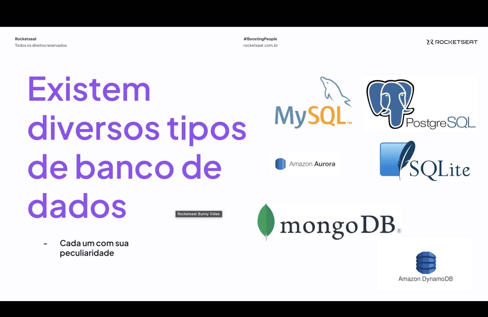
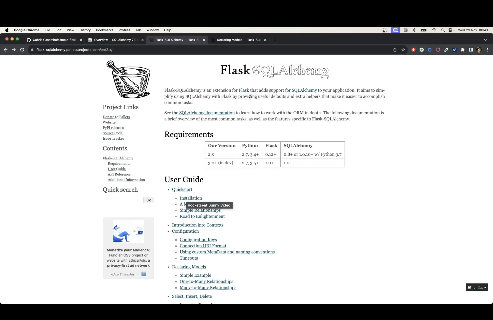
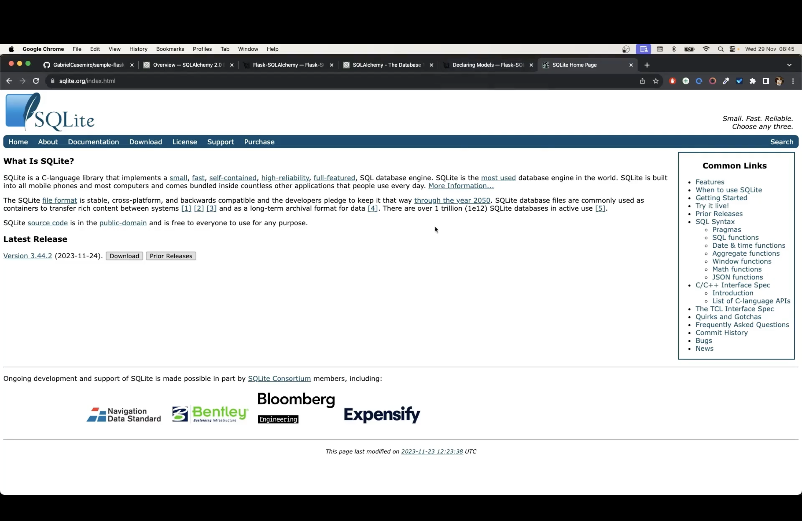
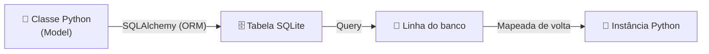

<h1 align="center">🚀 Aula 93 — Conceito de Banco de Dados e Utilização do SQLAlchemy (parte 1)</h1>

  
  
  
  

<h2 align="left">📌 Para que serve o banco de dados?</h2>

Até aqui, o projeto guardava tarefas e usuários em listas e dicionários dentro do próprio código. O problema: estruturas de dados em Python (listas, tuplas, dicionários) só existem enquanto o processo está rodando — a cada reinício da aplicação, tudo se perde. Um **banco de dados** é projetado justamente para armazenamento, recuperação e gerenciamento de informações de forma persistente.

---

## 💾 Memória volátil x memória não volátil

| | Memória volátil | Memória não volátil |
| :--- | :--- | :--- |
| Energia | Precisa de energia para manter a informação | Guarda a informação mesmo sem alimentação |
| Uso | Usada pelo computador para "trabalhar" | Usada para armazenar dados do computador |
| Velocidade | Acesso rápido | Acesso mais lento |
| Exemplo | Memória RAM (onde vivem listas, tuplas e dicionários) | Disco Rígido, CD, ROM, SSD (onde vive o banco de dados) |

---

## 🗄️ Tipos de banco de dados

Existem diversos bancos de dados no mercado, cada um com sua peculiaridade — relacionais como MySQL, PostgreSQL, Amazon Aurora e SQLite, ou não relacionais como MongoDB e Amazon DynamoDB:

---

## 🔗 SQLAlchemy e Flask-SQLAlchemy

Para não escrever SQL puro dentro das rotas, o Flask usa a extensão **Flask-SQLAlchemy**, que integra o **SQLAlchemy** (ORM — Object Relational Mapper) à aplicação. Com ele, cada tabela do banco vira uma classe Python, e cada linha, uma instância dessa classe.

Neste projeto, o banco escolhido é o **SQLite** — um banco relacional leve, sem necessidade de servidor, que guarda tudo em um único arquivo local. Ideal para desenvolvimento e para projetos menores:

---

## ✅ Resumo

- Um banco de dados existe para **persistir** informações que, em Python, viveriam apenas em memória volátil (listas, tuplas, dicionários) e se perderiam a cada reinício da aplicação.
- **Memória volátil** (RAM) é rápida mas depende de energia; **memória não volátil** (disco, SSD) é mais lenta, porém mantém os dados salvos.
- Existem vários tipos de banco de dados — MySQL, PostgreSQL, Amazon Aurora, SQLite, MongoDB, Amazon DynamoDB —, cada um com suas peculiaridades.
- O projeto usará **SQLite** como banco, acessado através do **Flask-SQLAlchemy**, o ORM que mapeia classes Python para tabelas do banco.
- As próximas aulas colocam o SQLAlchemy em prática, criando os primeiros models da aplicação.
