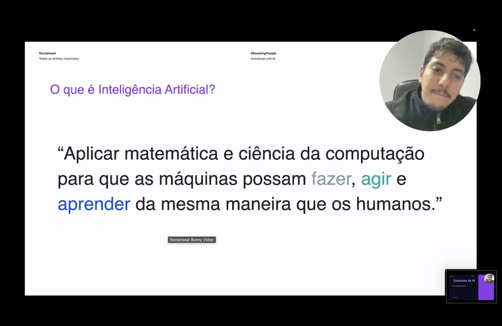
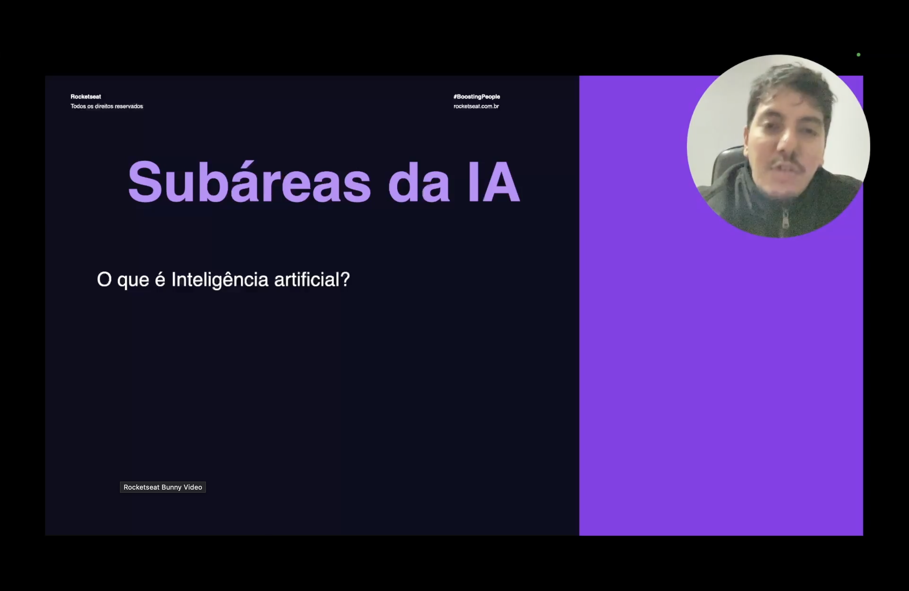
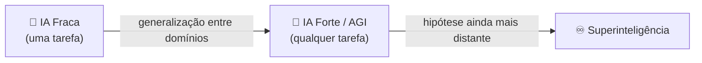

<h1 align="center">🚀 Strong AI ou AGI</h1>

  
  
  

<h2 align="left">📌 O que é Inteligência Artificial?</h2>

Antes de falar em IA forte, vale relembrar a definição usada no curso:

> "Aplicar matemática e ciência da computação para que as máquinas possam **fazer**, **agir** e **aprender** da mesma maneira que os humanos."

A IA se divide em subáreas — Machine Learning, Deep Learning, NLP, Visão Computacional, entre outras — cada uma resolvendo um tipo específico de tarefa:

---

## 🧠 Weak AI x Strong AI

Toda IA vista até aqui (recomendação de produtos, reconhecimento de imagem, chatbots) é o que chamamos de **IA Fraca (Weak AI / Narrow AI)**: sistemas treinados para resolver **um problema específico**, sem entendimento real do que fazem.

Já a **Strong AI**, ou **AGI (Artificial General Intelligence)**, é o conceito de uma inteligência artificial capaz de entender, aprender e aplicar conhecimento em **qualquer domínio**, com autonomia e raciocínio comparáveis aos de um ser humano — não apenas repetir padrões aprendidos em uma tarefa fixa.

| | IA Fraca (Narrow AI) | IA Forte (AGI) |
| :--- | :--- | :--- |
| Escopo | Resolve uma tarefa específica | Resolve qualquer tipo de problema |
| Adaptação | Não generaliza para outros domínios | Aprende e se adapta a domínios novos |
| Exemplos | Chatbots, recomendação, visão computacional | Ainda não existe — é um objetivo de pesquisa |
| Autonomia | Depende de treinamento supervisionado | Raciocínio e aprendizado autônomos |

---

## 🎯 Por que a AGI ainda não existe

Construir uma AGI exige que a máquina generalize conhecimento entre domínios completamente diferentes — algo que os modelos atuais, por mais poderosos que sejam, ainda não fazem de forma confiável. Toda IA em produção hoje (incluindo os grandes modelos de linguagem) continua sendo **IA fraca especializada**, ainda que muito boa em várias tarefas ao mesmo tempo.

---

## ✅ Resumo

- **IA Fraca (Narrow AI)** resolve uma tarefa específica e é o que existe em produção hoje — inclusive os modelos mais avançados.
- **IA Forte (Strong AI / AGI)** é o conceito de uma inteligência capaz de raciocinar e aprender em qualquer domínio, como um humano.
- A AGI ainda **não existe** — é um objetivo de pesquisa, não uma tecnologia disponível.
- Entender essa diferença ajuda a avaliar de forma realista o que os sistemas de IA atuais conseguem (e não conseguem) fazer.
