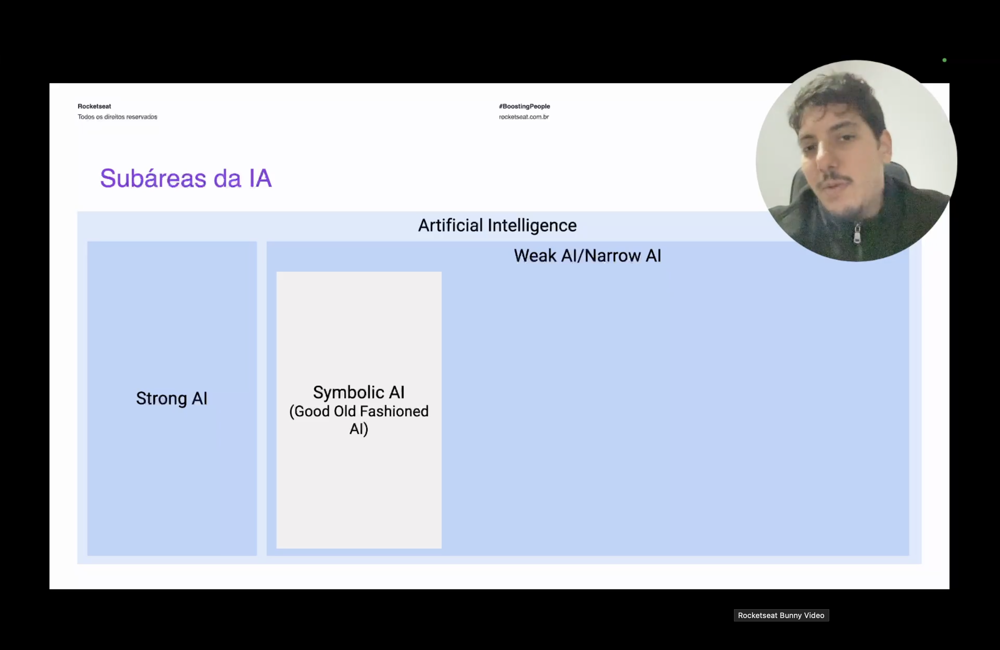
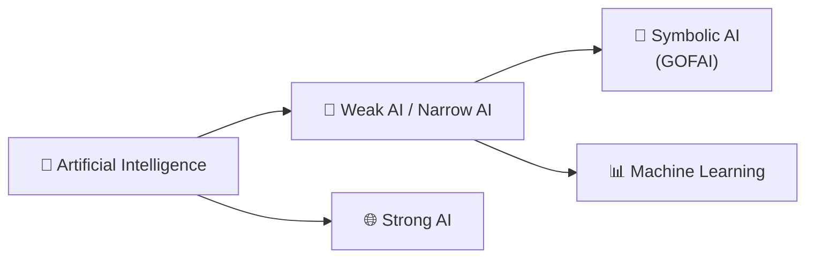

<h1 align="center">🚀 Symbolic AI</h1>

<p align="center">
  
  
  
</p>

<h2 align="left">📌 Onde a Symbolic AI se encaixa</h2>

Vista a diferença entre **Weak AI** e **Strong AI**, o diagrama de subáreas mostra onde cada abordagem se posiciona dentro da IA: a **Symbolic AI** — também chamada de **GOFAI (Good Old Fashioned AI)** — é uma das abordagens que compõem a Weak AI/Narrow AI:

<p align="center"></p>

---

## 🔣 O que é Symbolic AI

A **Symbolic AI** foi a abordagem dominante nas primeiras décadas da Inteligência Artificial (anos 1950–1980). Em vez de aprender padrões a partir de dados, como fazem Machine Learning e Deep Learning, ela representa o conhecimento por meio de **símbolos** — palavras, regras e relações — manipulados por lógica formal.

O raciocínio é feito com regras explícitas do tipo `SE <condição> ENTÃO <ação>`, escritas manualmente por especialistas humanos:

```
SE temperatura > 38°C
ENTÃO paciente está com febre
```

---

## ⚖️ Symbolic AI x Machine Learning

| | Symbolic AI (GOFAI) | Machine Learning |
| :--- | :--- | :--- |
| Conhecimento | Regras e lógica escritas por humanos | Padrões aprendidos a partir de dados |
| Transparência | Alta — decisões são rastreáveis regra a regra | Baixa — modelo costuma ser uma "caixa-preta" |
| Flexibilidade | Baixa — só cobre o que foi previsto nas regras | Alta — generaliza para casos não previstos |
| Exemplo | Sistemas especialistas, motores de regras | Redes neurais, árvores de decisão |

---

## 🧩 Limitações que abriram espaço para o Machine Learning

A Symbolic AI funciona bem em domínios fechados e bem definidos, mas escala mal: cada novo cenário exige que um especialista escreva novas regras à mão, e o sistema não aprende sozinho com a experiência. Essa rigidez foi um dos motivos que levaram a IA a migrar, décadas depois, para abordagens estatísticas baseadas em dados — o Machine Learning.



---

## ✅ Resumo

- **Symbolic AI (GOFAI)** é uma abordagem de IA baseada em regras lógicas escritas por humanos, e faz parte da **Weak AI**.
- Diferente do Machine Learning, ela não aprende com dados — o conhecimento é todo programado manualmente.
- Suas vantagens são a transparência e a rastreabilidade das decisões; sua limitação é a falta de flexibilidade para lidar com cenários não previstos.
- Essa rigidez foi um dos fatores que impulsionou a virada da IA para abordagens estatísticas orientadas a dados.
