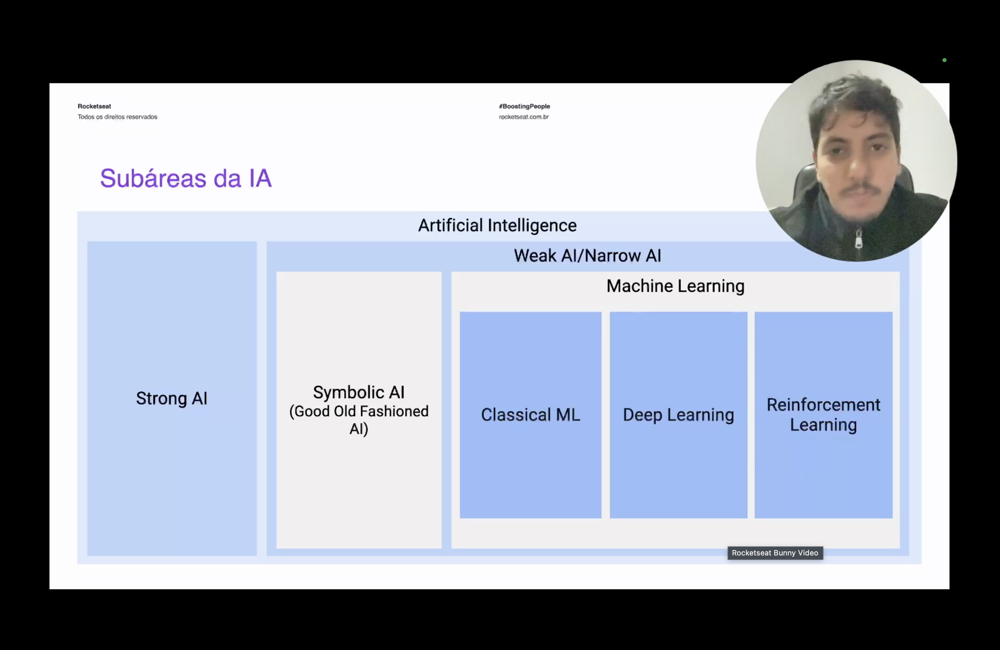
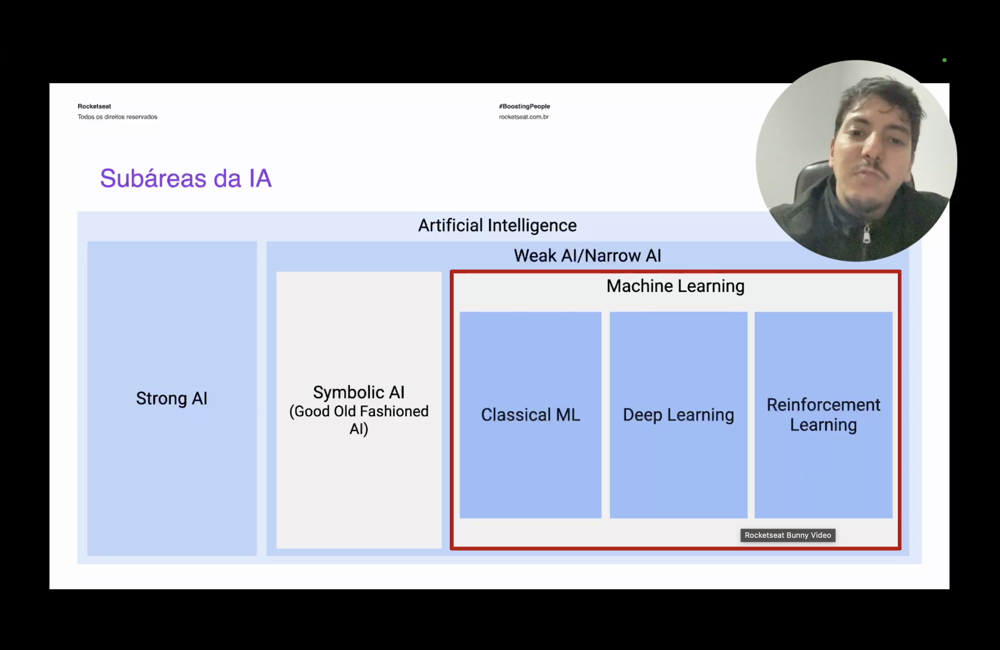
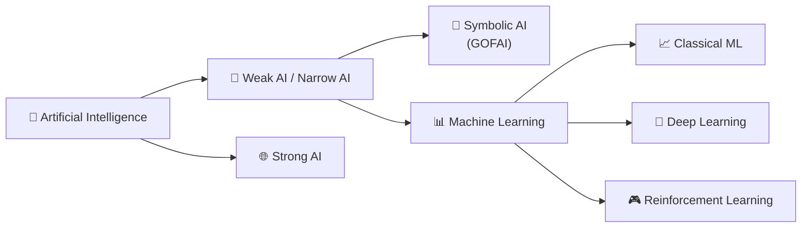

<h1 align="center">🚀 Machine Learning, a IA real</h1>

  
  
  

<h2 align="left">📌 Onde o Machine Learning se encaixa</h2>

Ao lado da Symbolic AI, dentro da Weak AI/Narrow AI, está o **Machine Learning**: a abordagem que aprende padrões a partir de dados em vez de seguir regras escritas manualmente.

---

## 🤖 O que é Machine Learning

Diferente da Symbolic AI, o Machine Learning não recebe regras prontas — ele **aprende** a resolver um problema a partir de exemplos (dados). É essa capacidade de aprender com a experiência, sem ser explicitamente programado para cada caso, que faz dele ser tratado como a "IA real": o sistema generaliza para situações que nunca viu.

O Machine Learning se divide em três grandes subáreas:

| Subárea | O que faz |
| :--- | :--- |
| **Classical ML** | Algoritmos estatísticos clássicos (regressão, árvores de decisão, KNN, etc.) treinados sobre dados estruturados |
| **Deep Learning** | Redes neurais profundas, capazes de aprender padrões complexos direto de dados brutos (imagem, texto, áudio) |
| **Reinforcement Learning** | Aprendizado por tentativa e erro, guiado por recompensas — o agente aprende agindo no ambiente |

---

## ⚖️ Machine Learning x Symbolic AI

| | Symbolic AI (GOFAI) | Machine Learning |
| :--- | :--- | :--- |
| Como aprende | Não aprende — regras escritas por humanos | Aprende padrões a partir de dados |
| Escala | Cada cenário novo exige reescrever regras | Generaliza para casos não vistos no treino |
| Transparência | Alta — decisões rastreáveis regra a regra | Baixa — modelo costuma ser uma "caixa-preta" |

---

## ✅ Resumo

- **Machine Learning** aprende padrões a partir de dados, em vez de seguir regras escritas manualmente — por isso é considerado a "IA real".
- Divide-se em três subáreas: **Classical ML**, **Deep Learning** e **Reinforcement Learning**.
- Sua principal vantagem sobre a Symbolic AI é generalizar para casos não previstos; sua desvantagem é a menor transparência nas decisões.
