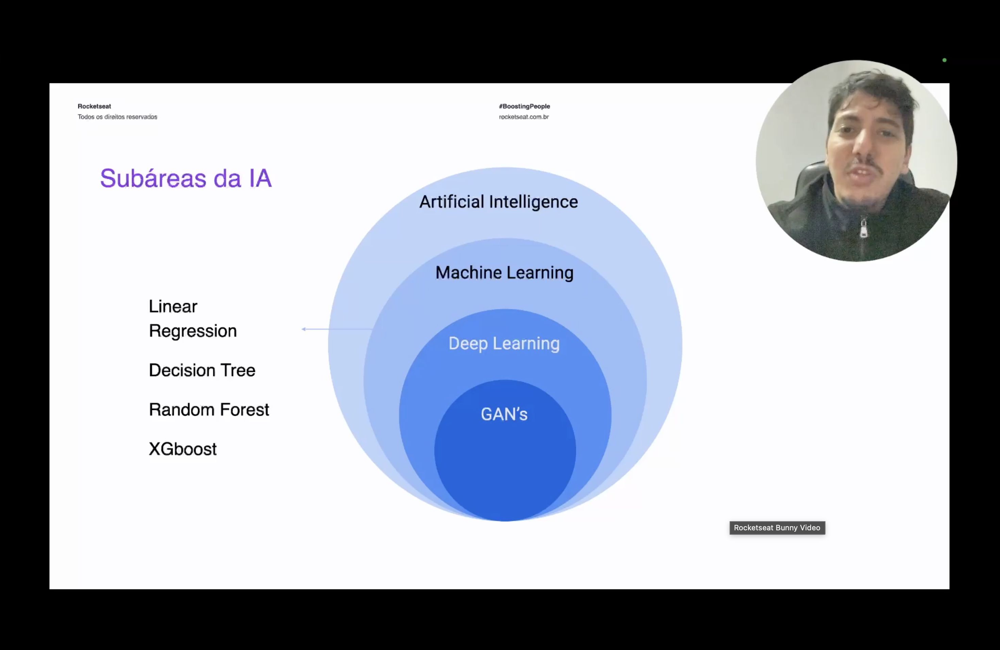
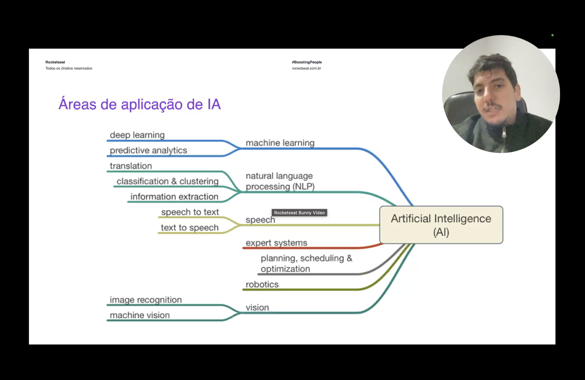
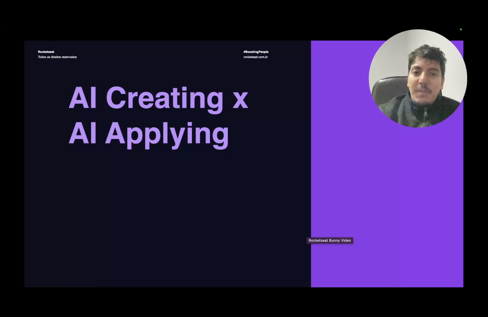
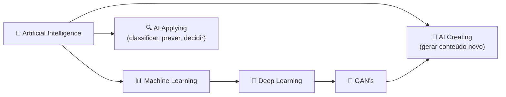

<h1 align="center">🚀 Técnicas e Aplicações de Machine Learning</h1>

  
  
  

<h2 align="left">🧮 Técnicas de Classical ML</h2>

Dentro do Classical ML (visto na aula anterior), algumas técnicas aparecem em praticamente todo problema de dados estruturados:

| Técnica | Ideia central |
| :--- | :--- |
| **Linear Regression** | Ajusta uma reta (ou hiperplano) que relaciona variáveis de entrada a uma saída numérica |
| **Decision Tree** | Divide os dados em perguntas sucessivas do tipo SE/ENTÃO até chegar numa decisão |
| **Random Forest** | Combina várias Decision Trees treinadas em subconjuntos diferentes dos dados, votando no resultado final |
| **XGBoost** | Constrói árvores em sequência, cada uma corrigindo o erro da anterior — muito usado em competições e produção |

Random Forest e XGBoost são exemplos de **ensemble**: várias árvores fracas combinadas formam um modelo mais forte e mais resistente a overfitting do que uma única árvore.

---

## 🌍 Áreas de aplicação de IA

Além das subáreas técnicas (Machine Learning, Deep Learning, RL), a IA também pode ser organizada pelo **tipo de problema que resolve**:

| Área | O que resolve |
| :--- | :--- |
| **NLP** (Natural Language Processing) | Tradução, classificação/clustering de texto, extração de informação |
| **Speech** | Conversão voz-texto (speech to text) e texto-voz (text to speech) |
| **Vision** | Reconhecimento de imagem, machine vision |
| **Robotics** | Controle e tomada de decisão de robôs físicos |
| **Expert Systems** | Sistemas de regras para domínios específicos (herança da Symbolic AI) |
| **Planning, Scheduling & Optimization** | Encontrar a melhor sequência de ações dado um conjunto de restrições |

Machine Learning e Deep Learning não são áreas isoladas — eles são as técnicas por trás de várias dessas aplicações (ex: Deep Learning viabiliza boa parte do NLP e da Vision atuais).

---

## 🆚 AI Creating x AI Applying

Existe uma distinção prática de como a IA é usada:

- **AI Applying** — a IA analisa dados existentes para classificar, prever ou decidir algo (ex: prever se um cliente vai cancelar um plano, detectar fraude, recomendar produtos).
- **AI Creating** — a IA gera conteúdo novo que não existia antes (ex: imagens, texto, áudio) — é o caso de GAN's e dos modelos generativos modernos.

---

## ✅ Resumo

- **Linear Regression, Decision Tree, Random Forest e XGBoost** são técnicas centrais do Classical ML — as duas últimas combinam várias árvores (ensemble) para ganhar precisão e robustez.
- A IA também pode ser organizada por **área de aplicação**: NLP, Speech, Vision, Robotics, Expert Systems e Planning/Optimization — cada uma resolvendo um tipo de problema diferente.
- **AI Applying** usa IA para analisar e decidir sobre dados existentes; **AI Creating** usa IA (como GAN's) para gerar conteúdo novo — é a base dos modelos generativos.
