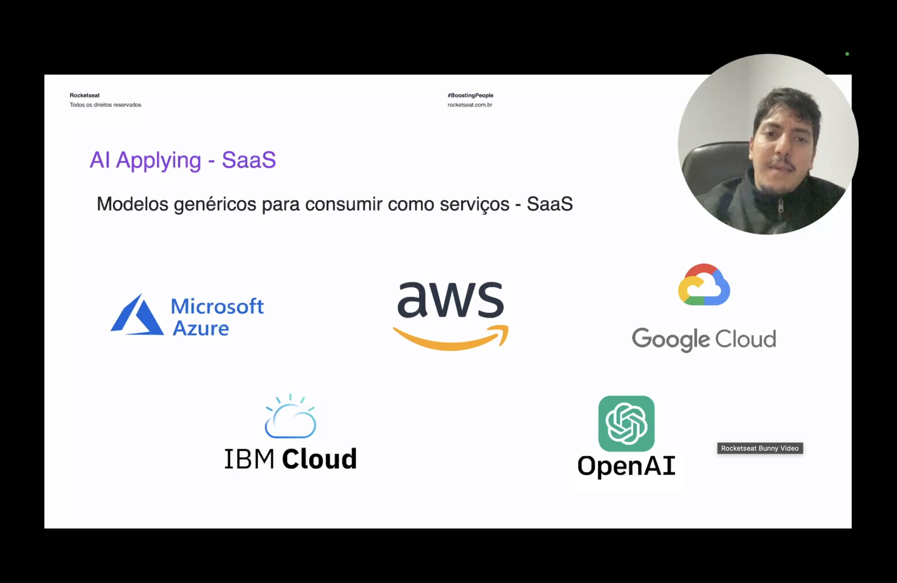
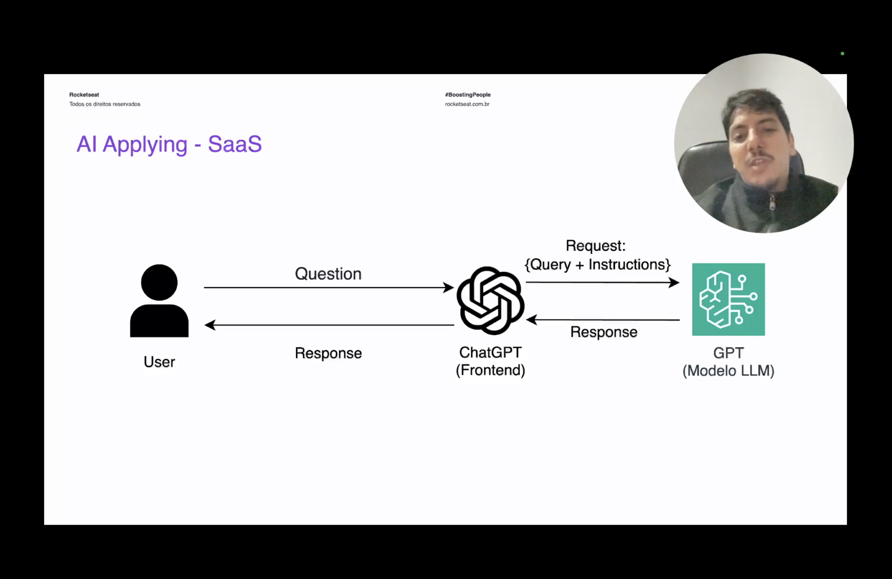

<h1 align="center">🚀 AI Applying</h1>

  
  
  

<h2 align="left">☁️ AI Applying - SaaS</h2>

Na prática, a forma mais comum de aplicar IA hoje não é treinar um modelo do zero — é **consumir modelos genéricos já prontos, como serviço (SaaS)**:

| Provedor | Serviço |
| :--- | :--- |
| **Microsoft Azure** | AI/ML como parte da nuvem Azure |
| **AWS** | Serviços de IA/ML da Amazon |
| **Google Cloud** | AI/ML como parte do Google Cloud Platform |
| **IBM Cloud** | Plataforma de IA da IBM (herdeira do Watson) |
| **OpenAI** | Modelos de linguagem (GPT) consumidos via API |

Em vez de coletar dados, treinar e hospedar um modelo, uma aplicação simplesmente **chama uma API** e recebe o resultado pronto — o que reduz drasticamente o custo e o tempo para colocar IA em produção.

---

## 🔗 Como funciona por baixo: o exemplo do ChatGPT

O ChatGPT é um bom exemplo de AI Applying na prática: ele **não é** o modelo em si, é o **frontend** que fala com o modelo:

1. O **User** faz uma pergunta ao **ChatGPT (Frontend)**.
2. O ChatGPT monta uma **Request** — `{ Query + Instructions }` — e envia para o **GPT (Modelo LLM)**.
3. O modelo processa e devolve uma **Response** ao ChatGPT.
4. O ChatGPT repassa essa resposta de volta ao usuário.

Essa separação entre frontend (interface) e modelo (LLM, consumido via API) é o mesmo padrão usado por qualquer aplicação que integra IA como serviço — a aplicação nunca precisa saber como o modelo foi treinado, só como chamá-lo.

---

## ✅ Resumo

- **AI Applying via SaaS** é consumir modelos genéricos de IA prontos, oferecidos por grandes provedores (Azure, AWS, Google Cloud, IBM Cloud, OpenAI), em vez de treinar um modelo próprio.
- O **ChatGPT** ilustra esse padrão: um frontend que envia `{Query + Instructions}` para um modelo LLM (GPT) via API e retorna a resposta ao usuário.
- Essa abordagem reduz custo e complexidade — a aplicação usa a IA como um serviço externo, sem precisar treinar ou hospedar o modelo.
