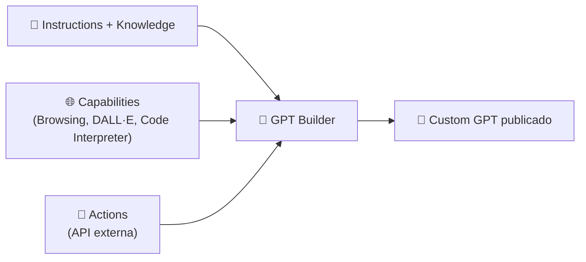

<h1 align="center">🚀 Criando um GPT via OpenAI</h1>

  
  
  

> *Aula sem prints associados — resumo baseado em conhecimento geral da ferramenta (GPT Builder); revisar após assistir ao vídeo.*

<h2 align="left">🛠️ O que é um Custom GPT</h2>

Um **Custom GPT** é uma versão especializada do ChatGPT, montada sem código através do **GPT Builder**: um modelo genérico (GPT) recebe instruções, conhecimento e capacidades específicas para se comportar como um assistente dedicado a uma tarefa — isso é AI Applying na prática, sem escrever nenhuma linha de código.

---

## ⚙️ Seções do GPT Builder

| Seção | Papel |
| :--- | :--- |
| **Name / Description** | Identidade do GPT — nome e resumo do que ele faz |
| **Instructions** | Prompt de sistema: regras de comportamento, tom, limites |
| **Conversation starters** | Sugestões de pergunta exibidas ao abrir o chat |
| **Knowledge** | Arquivos enviados (PDF, texto, planilhas) que o GPT consulta como contexto |
| **Capabilities** | Web Browsing, DALL·E (geração de imagem), Code Interpreter & Data Analysis |
| **Actions** | Chamadas a APIs externas via schema OpenAPI, para o GPT executar ações reais |

---

## 📤 Publicando o GPT

Depois de configurado, o GPT pode ser publicado em três níveis de visibilidade:

- **Only me** — uso pessoal.
- **Anyone with the link** — compartilhável sem estar no GPT Store.
- **GPT Store** — publicado publicamente, exige verificação da conta.

---

## ✅ Resumo

- Um **Custom GPT** é criado sem código no **GPT Builder**, combinando instruções, conhecimento e capacidades sobre um modelo GPT genérico.
- As peças principais são **Instructions** (comportamento), **Knowledge** (contexto), **Capabilities** (browsing, imagem, código) e **Actions** (integração com APIs externas).
- A publicação pode ser privada, por link, ou pública no GPT Store — essa última exige verificação.
