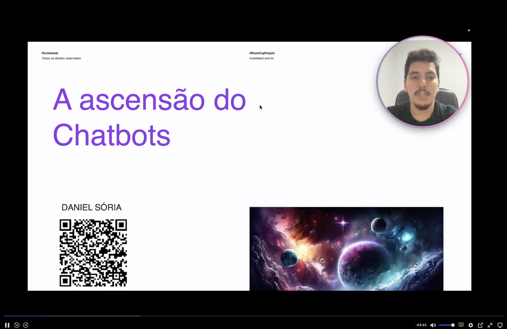
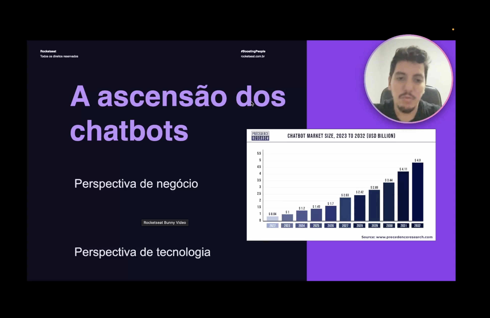

<h1 align="center">💬 A ascensão dos Chatbots - Introdução</h1>

  
  
  

<h2 align="left">📌 Abertura do módulo</h2>

O Nível 5 começa entendendo **por que os chatbots se tornaram tão relevantes** antes de partir para a construção de um. A aula é conduzida por Daniel Sória (Rocketseat).

---

## 📈 Um mercado em crescimento

Segundo a Precedence Research, o mercado de chatbots sai de **US$ 0,84 bi (2022)** e deve chegar a **US$ 4,9 bi (2032)** — quase 6x em dez anos.

| Ano | Tamanho do mercado (US$ bi) |
| :--- | :--- |
| 2022 | 0,84 |
| 2024 | 1,20 |
| 2026 | 1,70 |
| 2028 | 2,42 |
| 2030 | 3,44 |
| 2032 | 4,90 |

Para explicar essa ascensão, o módulo analisa o tema sob duas óticas:

- **Perspectiva de negócio** — qual problema os chatbots resolvem para as empresas.
- **Perspectiva de tecnologia** — o que mudou para que eles se tornassem viáveis.

---

## ✅ Resumo

- Chatbots são um mercado em forte expansão (US$ 0,84 bi → US$ 4,9 bi entre 2022 e 2032).
- A ascensão é explicada por dois fatores combinados: **demanda de negócio** e **maturidade tecnológica**.
