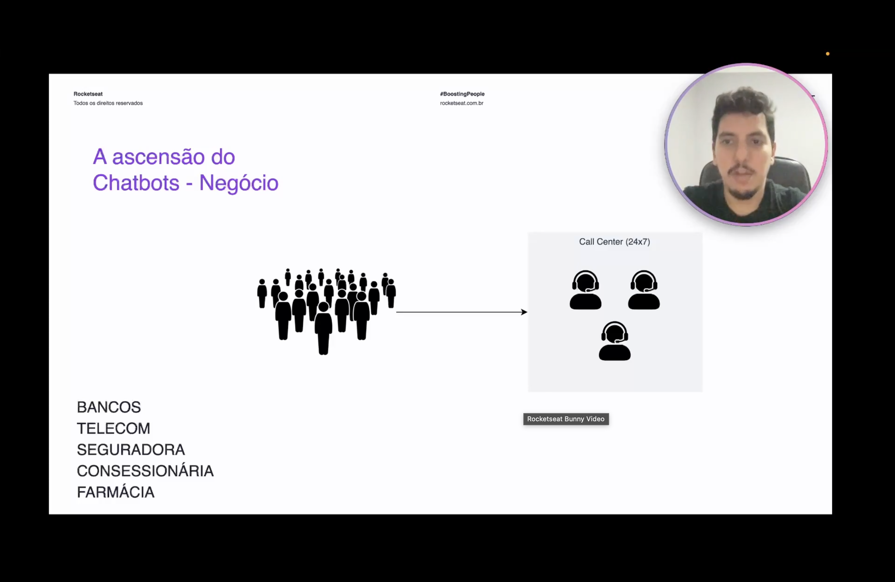
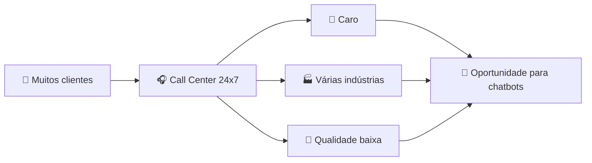

<h1 align="center">💼 A ascensão dos Chatbots - Perspectiva de negócio</h1>

  
  
  

<h2 align="left">📌 O problema do atendimento</h2>

Empresas com grande volume de clientes precisam manter um **Call Center 24x7**: muitas pessoas chegando com dúvidas e solicitações, e uma equipe humana limitada para atendê-las.

Setores que vivem esse cenário:

- Bancos
- Telecom
- Seguradoras
- Concessionárias
- Farmácias

---

## 🎯 Por que isso abre espaço para chatbots

| # | Problema | Por que importa |
| :--- | :--- | :--- |
| 1 | **Grande e caro** | Manter equipes humanas 24h por dia, 7 dias por semana, custa muito |
| 2 | **De diversas indústrias** | Não é nicho — bancos, telecom, seguros, varejo… todos enfrentam |
| 3 | **De qualidade do atendimento** | Filas, demora e respostas inconsistentes frustram o cliente |

---

## ✅ Resumo

- O atendimento ao cliente é um **problema grande, caro e espalhado por várias indústrias**.
- A qualidade do atendimento humano em escala é difícil de manter.
- Esse cenário cria a demanda de negócio que impulsiona os chatbots.
