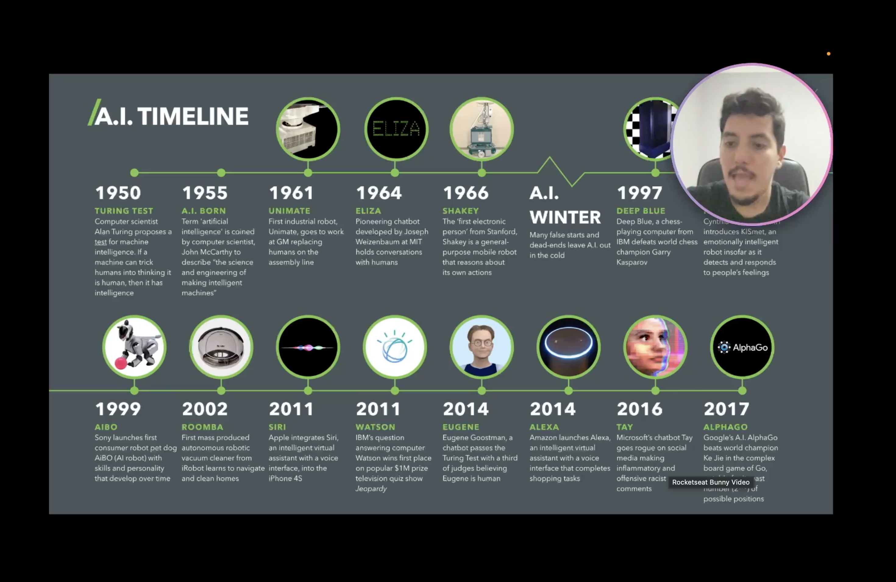
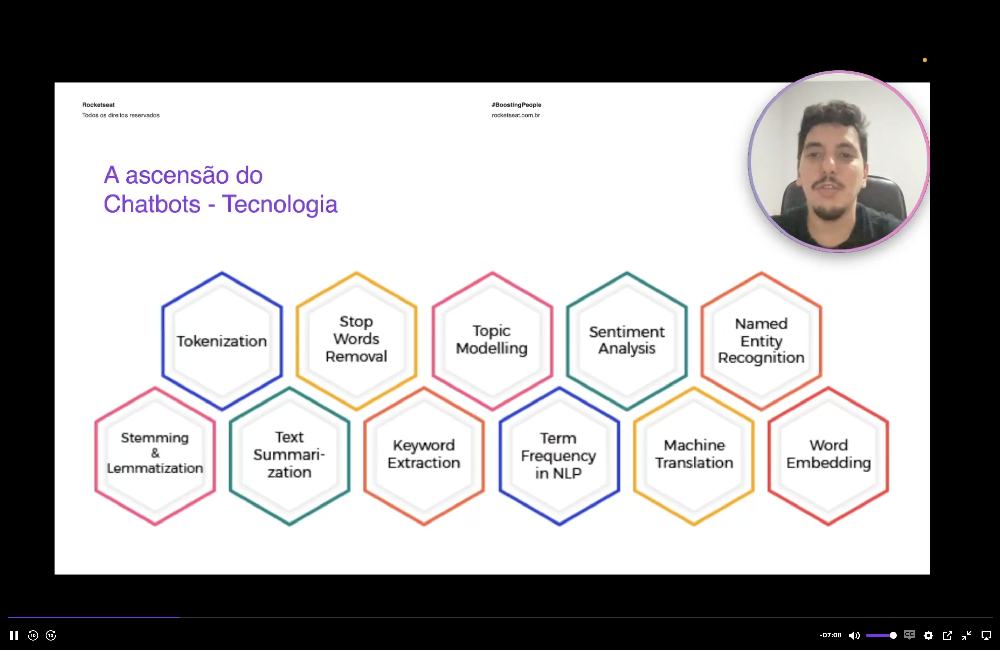
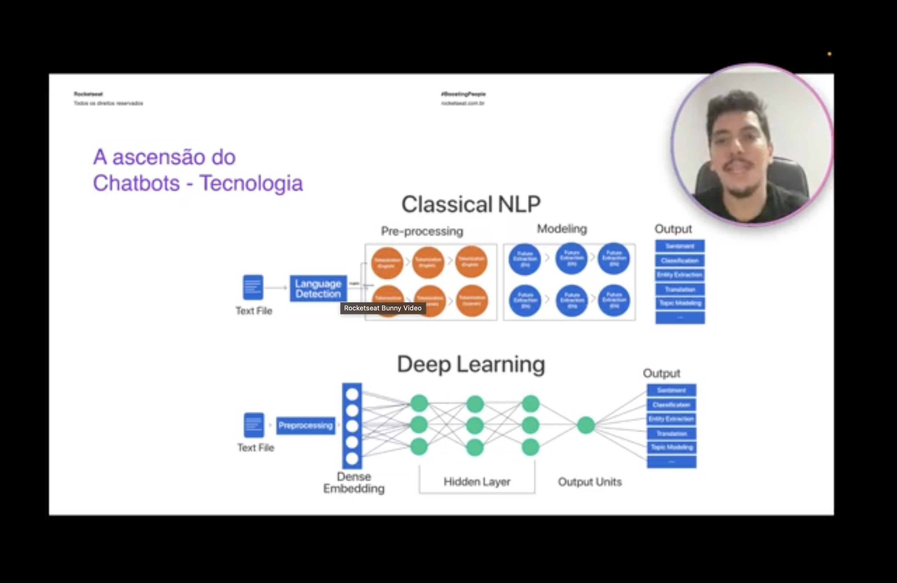
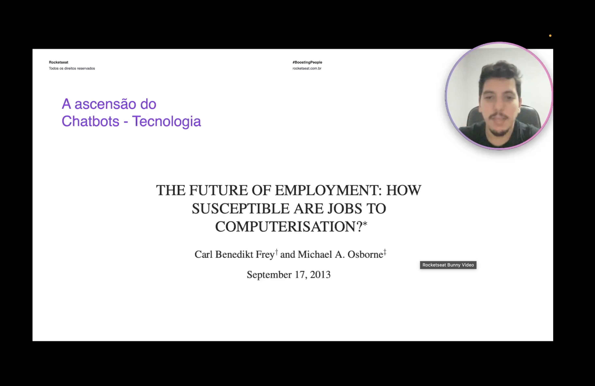

<h1 align="center">⚙️ A ascensão dos Chatbots - Perspectiva de tecnologia</h1>

  
  
  

<h2 align="left">📌 Uma longa linha do tempo</h2>

Chatbots não são novidade: a IA vem evoluindo desde os anos 50, e conversar com máquinas é um objetivo antigo.

| Ano | Marco |
| :--- | :--- |
| 1950 | **Teste de Turing** — se a máquina engana um humano, ela é "inteligente" |
| 1955 | Termo *Artificial Intelligence* cunhado por John McCarthy |
| 1964 | **ELIZA** — primeiro chatbot, criado por Joseph Weizenbaum no MIT |
| — | **AI Winter** — falsas promessas deixam a IA de lado |
| 1997 | Deep Blue (IBM) vence Kasparov no xadrez |
| 2011 | **Siri** chega ao iPhone 4S; **Watson** (IBM) vence o Jeopardy |
| 2014 | **Eugene Goostman** passa no Teste de Turing; Amazon lança a **Alexa** |
| 2016 | **Tay** (Microsoft) sai do controle nas redes sociais |
| 2017 | AlphaGo (Google) vence o campeão mundial de Go |

---

## 🧩 NLP: a base dos chatbots

Para entender texto, um chatbot depende de **NLP (Natural Language Processing)** e de várias técnicas que já estão maduras:

| Técnica | O que faz |
| :--- | :--- |
| Tokenization | Quebra o texto em unidades (palavras/tokens) |
| Stop Words Removal | Remove palavras sem valor semântico ("o", "de", "e") |
| Stemming & Lemmatization | Reduz palavras à raiz/forma base |
| Sentiment Analysis | Identifica o tom (positivo, negativo, neutro) |
| Named Entity Recognition | Encontra nomes, lugares, datas, valores |
| Topic Modelling / Keyword Extraction | Descobre assuntos e palavras-chave |
| Text Summarization / Machine Translation | Resume e traduz textos |
| Word Embedding / Term Frequency | Representa palavras numericamente |

---

## 🧠 Classical NLP x Deep Learning

| | Classical NLP | Deep Learning |
| :--- | :--- | :--- |
| Pipeline | Detecção de idioma → pré-processamento → extração de features → modelo | Pré-processamento → *dense embedding* → camadas ocultas → saída |
| Features | Construídas manualmente, etapa por etapa | Aprendidas automaticamente pela rede |
| Saídas | Sentimento, classificação, entidades, tradução, tópicos | As mesmas, com um único modelo |

O salto do Deep Learning só foi possível com a **evolução massiva dos processadores** (GPUs), que tornou viável treinar redes grandes.

---

## 🏢 Impacto no trabalho

O estudo *The Future of Employment: How Susceptible are Jobs to Computerisation?* (Frey & Osborne, 2013) já apontava que muitas funções — incluindo atendimento — eram altamente automatizáveis.

---

## ✅ Resumo

- A ideia de conversar com máquinas existe desde o Teste de Turing (1950) e a ELIZA (1964).
- As técnicas de **NLP** estão maduras, e o **Deep Learning** simplificou o pipeline clássico.
- O poder computacional moderno tornou essas tecnologias viáveis em escala.
