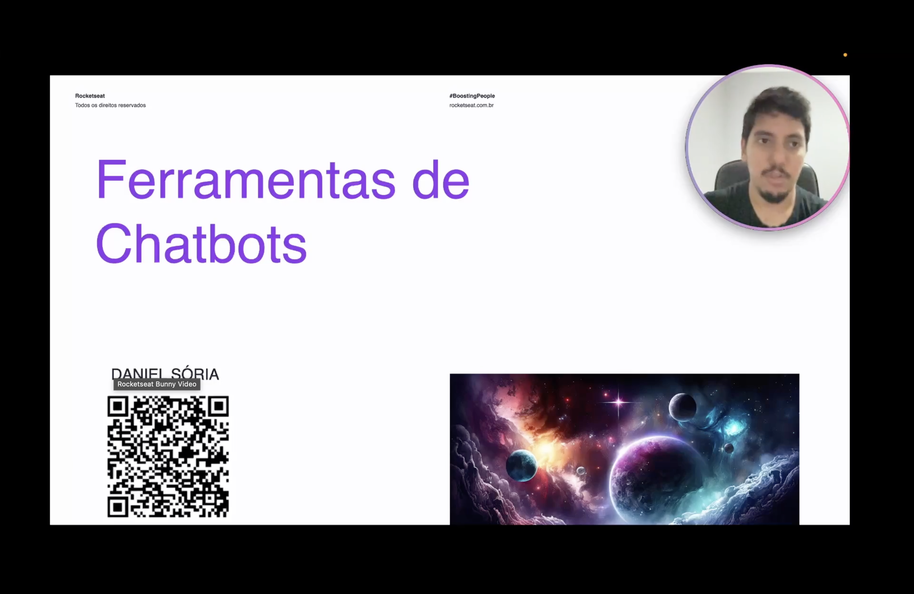
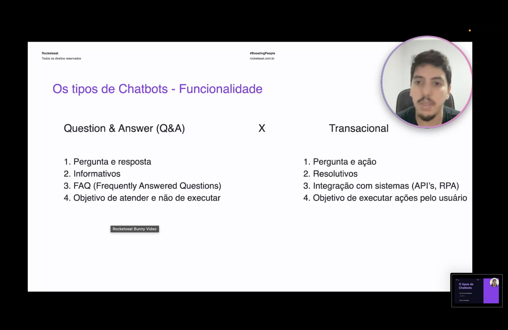
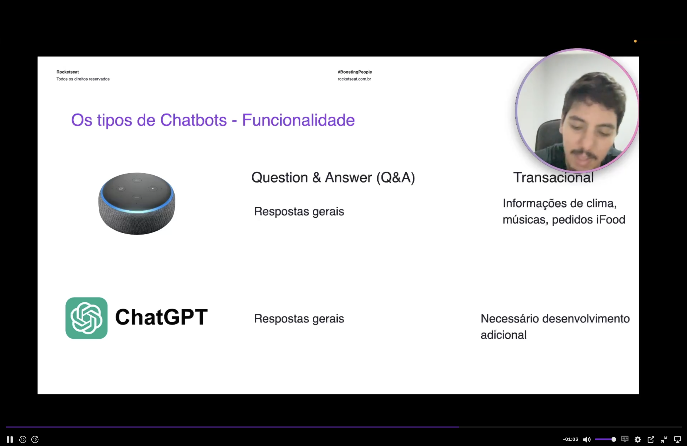

<h1 align="center">🛠️ Ferramentas de Chatbots - Funcionalidades</h1>

  
  
  

<h2 align="left">📌 Os tipos de Chatbots</h2>

Antes de escolher uma ferramenta, é preciso saber **que tipo de chatbot** será construído. Eles podem ser classificados de duas formas:

- **Tipo de funcionalidade** — o que o bot faz (esta aula).
- **Tipo de interação** — como o usuário conversa com ele (próxima aula).

---

## ⚖️ Question & Answer (Q&A) x Transacional

| | Q&A | Transacional |
| :--- | :--- | :--- |
| Dinâmica | Pergunta e **resposta** | Pergunta e **ação** |
| Natureza | Informativo | Resolutivo |
| Exemplo típico | FAQ (*Frequently Asked Questions*) | Integração com sistemas (APIs, RPA) |
| Objetivo | Atender, não executar | Executar ações pelo usuário |

---

## 💡 Exemplos práticos

| Produto | Q&A | Transacional |
| :--- | :--- | :--- |
| **Alexa** | Respostas gerais | Clima, músicas, pedidos no iFood |
| **ChatGPT** | Respostas gerais | Necessário desenvolvimento adicional |

---

## ✅ Resumo

- Chatbots são classificados por **funcionalidade** e por **interação**.
- **Q&A** responde e informa; **Transacional** age e resolve, integrando-se a sistemas via APIs/RPA.
- Um mesmo produto pode ser os dois — a Alexa responde perguntas e também executa pedidos.
