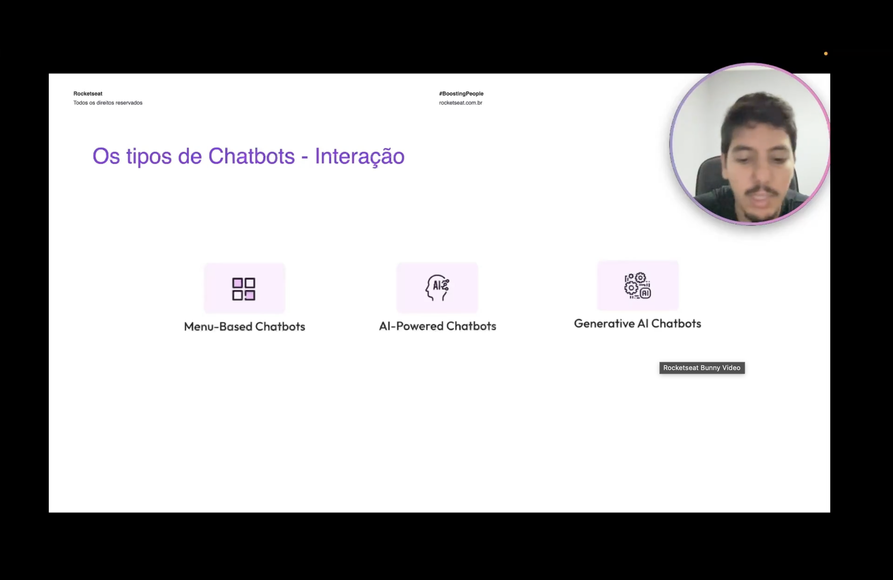
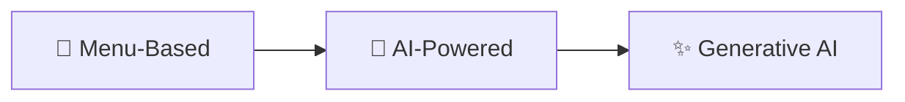
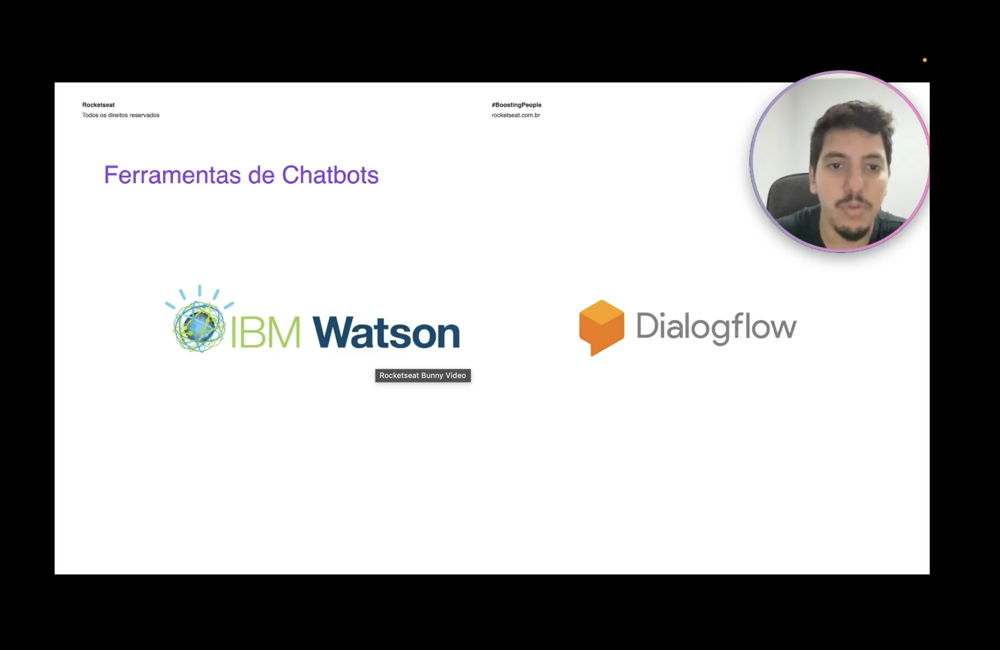

<h1 align="center">🗨️ Ferramentas de Chatbots - Interação</h1>

  
  
  

<h2 align="left">📌 Os tipos de Chatbots - Interação</h2>

Quanto à forma como o usuário conversa com o bot, existem três categorias:

| Tipo | Como funciona |
| :--- | :--- |
| **Menu-Based** | O usuário escolhe entre opções pré-definidas (botões/números); fluxo fixo e previsível |
| **AI-Powered** | Usa NLP para entender texto livre, identificando a **intenção** e as **entidades** da mensagem |
| **Generative AI** | Usa modelos generativos (LLMs) para criar respostas novas, não apenas escolher entre respostas prontas |

---

## 🧰 Ferramentas de Chatbots

| Ferramenta | Empresa |
| :--- | :--- |
| **IBM Watson** (Watson Assistant) | IBM |
| **Dialogflow** | Google |

Ambas são plataformas para construir chatbots **AI-Powered**, baseadas em intenções e entidades, com integrações para canais e sistemas externos.

---

## ✅ Resumo

- Por interação, chatbots são **Menu-Based**, **AI-Powered** ou **Generative AI**.
- **IBM Watson** e **Dialogflow** são as principais ferramentas apresentadas para desenvolver chatbots.
