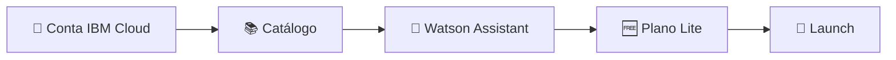

<h1 align="center">☁️ Criando instância na IBM Cloud</h1>

  
  
  

<h2 align="left">📌 Objetivo</h2>

Criar uma conta na **IBM Cloud** e provisionar uma instância do **Watson Assistant** (hoje chamado *watsonx Assistant*), a ferramenta usada no módulo para construir os chatbots.

---

## 🪜 Passo a passo

1. Acessar [cloud.ibm.com](https://cloud.ibm.com) e criar uma conta (ou fazer login).
2. No menu, abrir o **Catálogo** e buscar por **Watson Assistant**.
3. Configurar o serviço:

| Campo | Valor sugerido |
| :--- | :--- |
| Localização (região) | A mais próxima disponível (ex.: Dallas, Frankfurt) |
| Plano | **Lite** (gratuito) |
| Nome do serviço | Ex.: `watson-assistant-growup` |
| Grupo de recursos | `Default` |

4. Aceitar os termos e clicar em **Criar**.
5. Na página da instância, clicar em **Iniciar o Watson Assistant** (*Launch*) para abrir a ferramenta.

---

## 💡 Plano Lite

- Gratuito, ideal para estudo e protótipos.
- Possui limites de uso mensal (usuários ativos/mensagens) e pode ser excluído após um período sem uso.
- Uma instância Lite por conta para o mesmo serviço.

---

## ✅ Resumo

- O Watson Assistant é um serviço da **IBM Cloud**, criado a partir do **Catálogo**.
- O plano **Lite** é suficiente para o curso.
- Após criar a instância, o acesso à ferramenta é feito pelo botão **Launch**.
