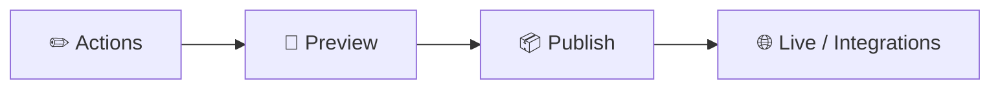

<h1 align="center">🧭 Overview IBM Watson</h1>

  
  
  

<h2 align="left">📌 Criando o primeiro assistente</h2>

Ao abrir o Watson Assistant pela primeira vez, ele pede para criar um **assistente**:

| Campo | Descrição |
| :--- | :--- |
| Nome | Nome do chatbot |
| Idioma | Idioma das conversas (ex.: Português - Brasil) |
| Descrição | Opcional |

Em seguida, ele pergunta onde o bot será usado (site, telefone, etc.) e permite personalizar a aparência do *web chat*.

---

## 🗂️ Menu lateral

| Seção | Para que serve |
| :--- | :--- |
| **Home** | Visão geral e atalhos do assistente |
| **Actions** | Onde as conversas são construídas (fluxos do bot) |
| **Preview** | Testar o bot como se fosse o usuário final |
| **Publish** | Gerar versões do conteúdo e publicar |
| **Environments** | Ambientes **Draft** (rascunho) e **Live** (produção) |
| **Integrations** | Canais: web chat, telefone, WhatsApp, Slack, etc. |
| **Analyze** | Métricas e histórico de conversas |

---

## ✅ Resumo

- Cada bot no Watson é um **assistente**, com nome e idioma próprios.
- O trabalho principal acontece em **Actions**; o **Preview** permite testar sem publicar.
- **Environments** separa rascunho de produção, e **Integrations** conecta o bot aos canais.
