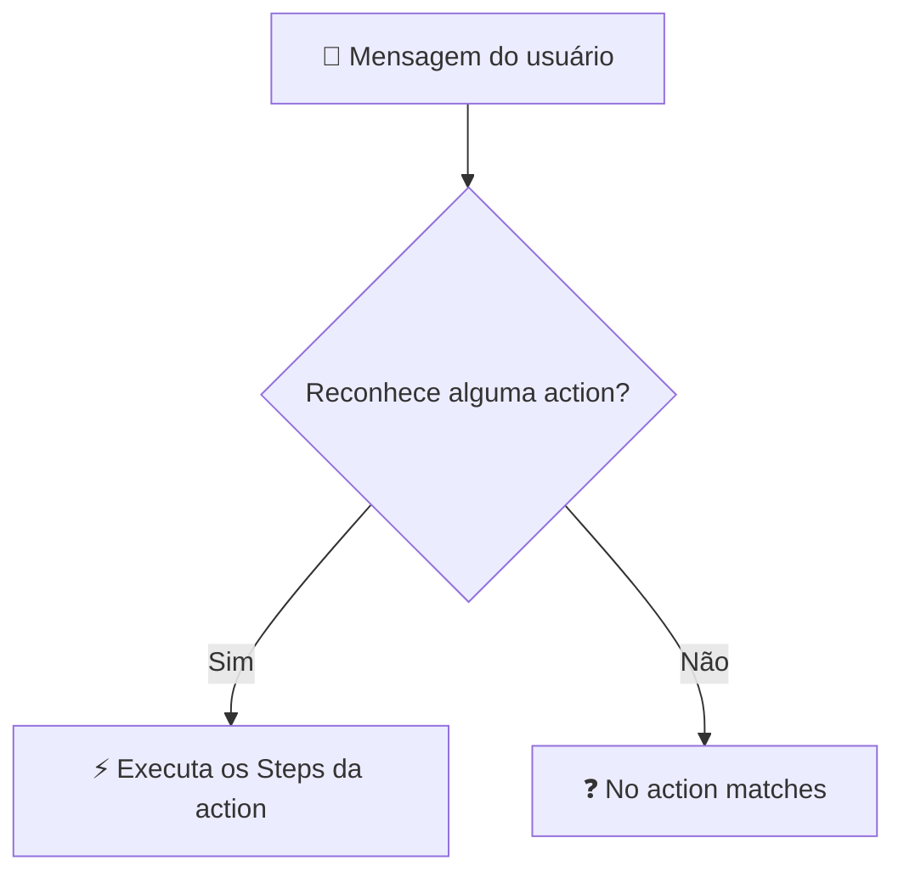

<h1 align="center">⚡ Overview Actions Watson</h1>

  
  
  

<h2 align="left">📌 O que é uma Action</h2>

Uma **Action** representa uma tarefa que o usuário quer resolver (ex.: "consultar saldo", "fazer pedido"). Ela é composta por **Steps** (passos), que formam a conversa.

---

## 🧱 Estrutura de uma Action

| Parte | Função |
| :--- | :--- |
| **Customer starts with** | Frases de exemplo que disparam a action (o Watson aprende a intenção a partir delas) |
| **Steps** | Passos da conversa, executados em ordem |
| **Assistant says** | O que o bot responde no passo |
| **Define customer response** | Tipo de resposta esperada do usuário |
| **And then** | O que fazer depois: continuar, ir para outra action, encerrar… |

### Tipos de resposta do cliente

| Tipo | Exemplo |
| :--- | :--- |
| Options | Botões de escolha |
| Number / Currency / Percent | Quantidade, valor |
| Date / Time | Data de entrega, horário |
| Confirmation | Sim / Não |
| Free text | Texto livre |
| Regex | Padrão customizado (CPF, e-mail) |

---

## 🧩 Actions do sistema (*Set by assistant*)

Além das actions criadas, o Watson já traz algumas prontas:

| Action | Quando roda |
| :--- | :--- |
| **Greet customer** | Ao iniciar a conversa |
| **No action matches** | Quando o bot não entende a mensagem |
| **Fallback** | Quando o usuário precisa de ajuda ou pede um atendente |

---

## ✅ Resumo

- **Actions** = tarefas do usuário; **Steps** = passos da conversa.
- *Customer starts with* treina o reconhecimento da intenção.
- Actions do sistema tratam saudação, mensagens não entendidas e fallback.
