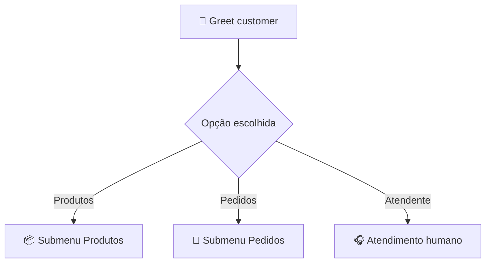

<h1 align="center">🔢 Menubased Chatbot Watson - parte 1</h1>

<p align="center">
  
  
  
</p>

<h2 align="left">📌 Objetivo</h2>

Construir um chatbot **Menu-Based**: o usuário não digita livremente, ele navega por **opções (botões)** pré-definidas.

---

## 🪜 Montando o menu inicial

1. Em **Actions → Set by assistant**, abrir **Greet customer**.
2. No step, em **Assistant says**, escrever a saudação.
3. Em **Define customer response**, escolher **Options** e cadastrar as opções do menu.

Exemplo de menu:

```text
Olá! 👋 Como posso te ajudar?
[ 1. Produtos ]  [ 2. Pedidos ]  [ 3. Falar com atendente ]
```

---

## 🔀 Desviando por opção

Para cada opção, cria-se um novo step **com condição** (*with conditions*), baseada na resposta do step anterior:

| Condição | Ação do step |
| :--- | :--- |
| `Step 1 = Produtos` | Mostra o submenu de produtos |
| `Step 1 = Pedidos` | Mostra o submenu de pedidos |
| `Step 1 = Falar com atendente` | **And then → Connect to agent** / encerrar |



---

## ✅ Resumo

- O menu inicial fica na action **Greet customer**, com resposta do tipo **Options**.
- Cada opção leva a um step condicionado à escolha do usuário.
