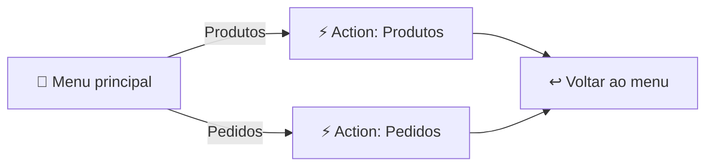

<h1 align="center">🔢 Menubased Chatbot Watson - parte 2</h1>

  
  
  

<h2 align="left">📌 Submenus e navegação</h2>

Com o menu principal pronto, cada ramo ganha seus próprios **submenus**, também com respostas do tipo **Options**.

---

## 🧭 Organizando em Actions

Em vez de colocar tudo em um único fluxo gigante, cada ramo pode virar uma **action própria**, chamada a partir do menu:

| Recurso | Uso |
| :--- | :--- |
| **And then → Go to a subaction** | Chama outra action e depois volta |
| **And then → Continue to next step** | Segue para o próximo step |
| **And then → End the action** | Encerra o fluxo atual |

---

## ↩️ Opção "Voltar"

Todo submenu deve ter uma opção para **voltar ao menu principal** ou **encerrar** — o usuário não pode ficar preso.

---

## ✅ Resumo

- Submenus usam o mesmo padrão: **Options** + steps condicionados.
- Separar ramos em **subactions** deixa o bot mais organizado.
- Sempre oferecer caminho de volta ou de saída.
