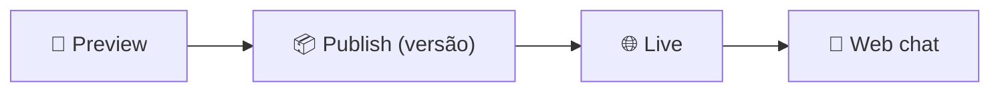

<h1 align="center">🔢 Menubased Chatbot Watson - parte 3</h1>

  
  
  

<h2 align="left">📌 Testando e finalizando</h2>

Com os fluxos montados, o bot é validado no **Preview** antes de ser publicado.

---

## 🧪 Checklist de teste

- [ ] A saudação aparece ao abrir o chat.
- [ ] Todas as opções do menu levam ao step correto.
- [ ] Os submenus têm opção de voltar/encerrar.
- [ ] Mensagens digitadas fora do menu caem em **No action matches**.

---

## 📦 Publicando

1. **Publish** → criar uma nova versão com descrição.
2. Atribuir a versão ao ambiente **Live**.
3. Em **Integrations**, usar o **Web chat** para obter o script de incorporação em um site.

---

## ⚖️ Prós e contras do Menu-Based

| Prós | Contras |
| :--- | :--- |
| Previsível e fácil de construir | Engessado — não entende texto livre |
| Sem erros de interpretação | Menus longos cansam o usuário |
| Bom para fluxos simples e fechados | Não escala para muitos assuntos |

---

## ✅ Resumo

- Testar todos os caminhos no **Preview** antes de publicar.
- Publicar = gerar versão → atribuir ao **Live** → integrar ao canal.
- Menu-Based é simples e confiável, mas limitado — daí a evolução para **AI Chatbots**.
