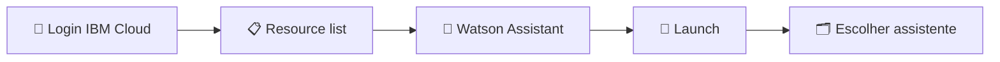

<h1 align="center">🔐 Realizando login no Watson</h1>

  
  
  

<h2 align="left">📌 Voltando ao assistente</h2>

Depois de criada a instância, não é preciso repetir o processo. Para acessar o Watson novamente:

1. Fazer login em [cloud.ibm.com](https://cloud.ibm.com).
2. Abrir a **Lista de recursos** (*Resource list*).
3. Em **AI / Machine Learning**, clicar na instância do **Watson Assistant**.
4. Clicar em **Launch** para abrir a ferramenta.
5. No topo, selecionar o **assistente** desejado (é possível ter vários na mesma instância).

---

## ✅ Resumo

- O acesso ao Watson é sempre pela **Resource list** da IBM Cloud.
- Uma instância pode conter vários assistentes — o seletor fica no topo da ferramenta.
