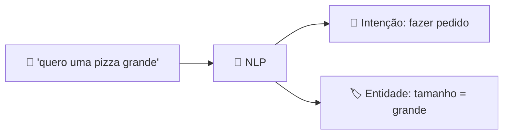

<h1 align="center">🧠 AI Chatbot</h1>

  
  
  

<h2 align="left">📌 Do menu à linguagem natural</h2>

No **AI-Powered Chatbot**, o usuário escreve livremente e o bot usa **NLP** para entender o que ele quer. No Watson isso se apoia em dois conceitos:

| Conceito | O que é | Exemplo |
| :--- | :--- | :--- |
| **Intenção** | *O que* o usuário quer fazer | "quero pedir uma pizza" → *fazer pedido* |
| **Entidade** | *Detalhes* dentro da mensagem | "pizza **grande** de **calabresa**" → tamanho, sabor |

No Watson Assistant atual, a intenção é treinada pelas frases de **Customer starts with** de cada action, e as entidades aparecem como respostas coletadas nos steps.

---

## ⚖️ Menu-Based x AI-Powered

| | Menu-Based | AI-Powered |
| :--- | :--- | :--- |
| Entrada do usuário | Botões | Texto livre |
| Entendimento | Nenhum — só a escolha | Reconhece intenção e entidades |
| Construção | Fluxos fixos | Frases de treino + fluxos |
| Experiência | Engessada | Natural |

---

## ✅ Resumo

- AI Chatbots entendem **texto livre** por meio de **intenções** e **entidades**.
- No Watson, as frases de *Customer starts with* treinam o reconhecimento da intenção.
