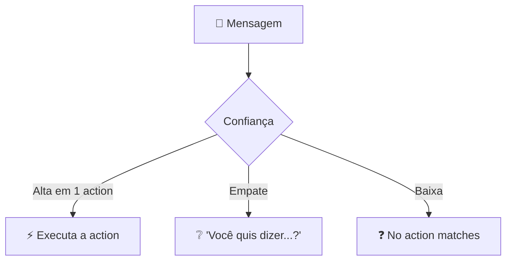

<h1 align="center">⚡ AI Chatbot Watson - Action parte 2</h1>

  
  
  

<h2 align="left">📌 Várias actions convivendo</h2>

Um AI Chatbot real tem várias actions. O Watson decide qual executar comparando a mensagem com as frases de treino de todas elas.

| Action | Exemplos de frases |
| :--- | :--- |
| Fazer pedido | "quero pedir", "me vê uma pizza" |
| Status do pedido | "cadê meu pedido?", "meu pedido já saiu?" |
| Horário de funcionamento | "vocês abrem que horas?", "estão abertos?" |

---

## 🤷 Quando há dúvida

| Situação | Comportamento do Watson |
| :--- | :--- |
| Nenhuma action reconhecida | Executa **No action matches** |
| Duas actions parecidas | Pergunta ao usuário qual ele quis dizer (*clarification*) |
| Usuário muda de assunto no meio | Pode trocar de action (*digression*) e depois retomar |

---

## ✅ Resumo

- O bot escolhe a action pela semelhança com as frases de treino.
- Ambiguidades geram pergunta de esclarecimento; baixa confiança cai em **No action matches**.
