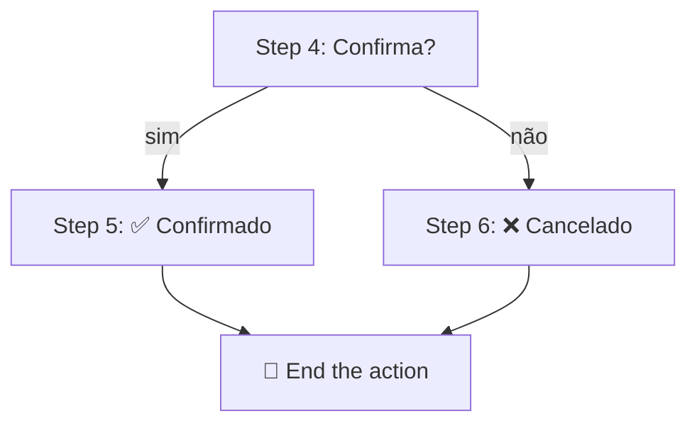

<h1 align="center">🪜 AI Chatbot Watson - Steps parte 2</h1>

  
  
  

<h2 align="left">📌 Condições e variáveis</h2>

### Steps com condição

Um step pode rodar só se uma condição for verdadeira (*with conditions*):

| Step | Condição | Assistant says |
| :--- | :--- | :--- |
| 5 | `Step 4 = sim` | Pedido confirmado! 🍕 |
| 6 | `Step 4 = não` | Sem problemas, pedido cancelado. |

### Variáveis

| Tipo | Escopo | Uso |
| :--- | :--- | :--- |
| **Action variables** | Só dentro da action | Respostas de cada step |
| **Session variables** | Toda a conversa | Dados compartilhados entre actions (ex.: nome do cliente) |

Em **Set variable values**, é possível atribuir valores ou expressões (ex.: `total = quantidade * preço`).

---

## ➡️ "And then"

| Opção | Efeito |
| :--- | :--- |
| Continue to next step | Segue o fluxo |
| Go to a subaction | Chama outra action |
| End the action | Finaliza a action |
| Connect to agent | Transfere para atendimento humano |
| Use an extension | Chama uma API externa |

---

## ✅ Resumo

- **Condições** criam ramificações a partir das respostas.
- **Session variables** compartilham dados entre actions.
- **And then** define o próximo passo, inclusive chamar APIs ou um humano.
