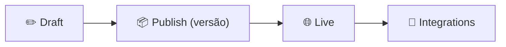

<h1 align="center">🏁 Finalizando AI Chatbot Watson</h1>

  
  
  

<h2 align="left">📌 Ajustes finais</h2>

| Item | O que revisar |
| :--- | :--- |
| **Greet customer** | Saudação explicando o que o bot sabe fazer |
| **No action matches** | Mensagem amigável + sugestão de assuntos |
| **Fallback** | Caminho para atendimento humano |
| Frases de treino | Variedade e ausência de conflito entre actions |

---

## 🧪 Teste final no Preview

- [ ] Cada action dispara com frases novas (não cadastradas).
- [ ] Steps já respondidos na frase inicial são pulados.
- [ ] Condições levam ao step correto.
- [ ] Mensagens fora do escopo caem em **No action matches**.

---

## 🚀 Publicação

1. **Publish** → criar versão.
2. Atribuir a versão ao ambiente **Live**.
3. Conectar um canal em **Integrations** (Web chat, WhatsApp, Slack…).
4. Acompanhar conversas reais em **Analyze** e ajustar as frases de treino.

---

## ✅ Resumo do módulo Watson

- **Menu-Based**: Greet customer + Options + steps condicionados.
- **AI-Powered**: Actions treinadas por frases, Steps que coletam dados, condições e variáveis.
- Ciclo de vida: **Draft → Publish → Live → Integrations → Analyze**.
