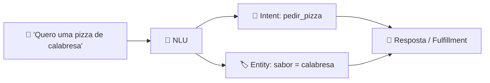

<h1 align="center">🤖 Usando o Google Dialogflow - Introdução</h1>

  
  
  

<h2 align="left">📌 O que é o Dialogflow</h2>

Plataforma do **Google Cloud** para criar agentes conversacionais (chatbots e voicebots) com **NLU** — entende a intenção do usuário em linguagem natural, sem precisar programar o modelo.

| Edição | Perfil | Modelo de construção |
| :--- | :--- | :--- |
| **Dialogflow ES** (Essentials) | Bots simples a médios | Baseado em **intents + contexts** |
| **Dialogflow CX** | Bots grandes e complexos | Baseado em **flows + pages** (máquina de estados visual) |

---

## 🧩 Conceitos básicos

| Conceito | Descrição | Paralelo no Watson |
| :--- | :--- | :--- |
| **Agent** | O chatbot em si | Assistant |
| **Intent** | O que o usuário quer dizer | Action (gatilho) |
| **Training phrases** | Exemplos de frases da intent | Customer starts with |
| **Entity** | Dado extraído da frase (data, cidade, sabor…) | Variáveis / Customer response |
| **Parameter** | Valor de uma entity guardado na conversa | Action variable |
| **Fulfillment** | Chamada a um webhook/API para gerar a resposta | Extension |

---

## 🚀 Primeiros passos

1. Criar/usar um projeto no **Google Cloud Console** (com faturamento ou free trial).
2. Acessar **dialogflow.cloud.google.com** (ES) ou **dialogflow.cloud.google.com/cx** (CX).
3. Criar o **Agent**: nome, idioma padrão (`pt-BR`) e fuso horário.
4. Testar no **simulador** lateral.

---

## ✅ Resumo

- Dialogflow = NLU do Google para bots de texto e voz.
- **ES** para bots simples; **CX** para fluxos complexos.
- Base de tudo: **Agent → Intents → Entities → Respostas/Fulfillment**.
