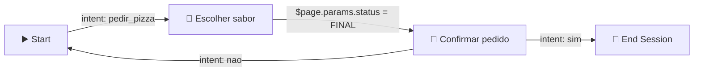

<h1 align="center">🗺️ Usando o Google Dialogflow - CX</h1>

  
  
  

<h2 align="left">📌 Estrutura do CX</h2>

O CX organiza a conversa como uma **máquina de estados** visual: o bot sempre está em uma **page**, e **routes** decidem para onde ir.

| Elemento | Descrição |
| :--- | :--- |
| **Flow** | Grande tópico da conversa (ex.: Pedido, Suporte). Todo agent tem o **Default Start Flow** |
| **Page** | Estado dentro do flow; pode coletar **parameters** (form) |
| **Route** | Transição disparada por **intent** e/ou **condição** |
| **Fulfillment** | Mensagem ou webhook executado ao entrar na page/route |
| **Event handler** | Trata eventos (`no-match`, `no-input`, erro de webhook) |
| **Route group** | Conjunto de routes reutilizável entre pages |

---

## 🛠️ Criando um fluxo

1. **Manage → Intents**: criar `pedir_pizza` com frases de treino.
2. No **Default Start Flow**, na page **Start**, adicionar uma **route** com a intent → transição para nova page *Escolher sabor*.
3. Na page, criar **parameter** `sabor` (entity `@sabor`, *required*) com prompt *"Qual sabor você quer?"*.
4. Route com condição `$page.params.status = "FINAL"` → page *Confirmar pedido*.
5. Testar no **Test Agent**, acompanhando a page atual e os parâmetros.

> 💡 Parâmetros de sessão são acessados com `$session.params.sabor` nas mensagens.

---

## ⚖️ CX × ES

| | ES | CX |
| :--- | :--- | :--- |
| Controle de fluxo | Contexts (manual) | Pages + routes (visual) |
| Escala | Poucos intents | Centenas de intents/flows |
| Versionamento/ambientes | Básico | Versions, environments, experiments |
| Custo | Menor | Maior por requisição |

---

## ✅ Resumo

- CX = **flows → pages → routes**, desenhados no builder visual.
- Pages coletam parâmetros como um formulário.
- Ideal para bots grandes, com vários times e muitos caminhos.
