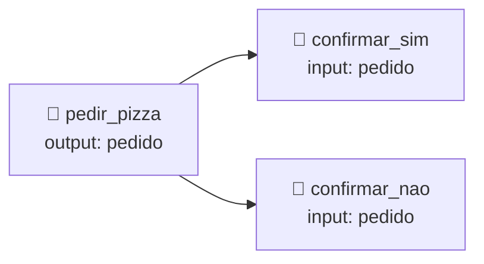

<h1 align="center">🧱 Usando o Google Dialogflow - Essentials</h1>

  
  
  

<h2 align="left">📌 Estrutura do ES</h2>

No ES tudo gira em torno de **intents**: cada mensagem do usuário é casada com a intent mais provável.

| Intent padrão | Função |
| :--- | :--- |
| **Default Welcome Intent** | Saudação (`oi`, `olá`) |
| **Default Fallback Intent** | Quando nenhuma intent casa |

### Anatomia de uma intent

| Seção | Exemplo (`pedir_pizza`) |
| :--- | :--- |
| **Contexts** | input: — / output: `pedido` |
| **Training phrases** | "quero uma pizza de *calabresa*" |
| **Action and parameters** | `sabor` → `@sabor` (required, prompt: *"Qual sabor?"*) |
| **Responses** | "Pizza de $sabor anotada! Confirma?" |
| **Fulfillment** | Webhook opcional para gerar a resposta |

---

## 🏷️ Entities

| Tipo | Exemplo |
| :--- | :--- |
| **System** | `@sys.date`, `@sys.number`, `@sys.geo-city` |
| **Custom** | `@sabor`: calabresa, mussarela, portuguesa (+ sinônimos) |

---

## 🔗 Contexts (controle de fluxo)

Contexts lembram em que ponto da conversa o usuário está. Uma intent com **input context** só é ativada se aquele contexto estiver ativo.

> 💡 **Follow-up intents** (botão *Add follow-up intent*) criam esses contexts automaticamente para `yes`/`no`.

---

## 🌐 Integrations

Em **Integrations**: Web Demo, Dialogflow Messenger (widget para sites), Telegram, Slack, Messenger, telefonia, entre outros.

---

## ✅ Resumo

- ES = **intents + entities + contexts**.
- **Follow-up intents** facilitam perguntas de sim/não.
- **Fulfillment** conecta o bot a APIs; **Integrations** publica em canais.
