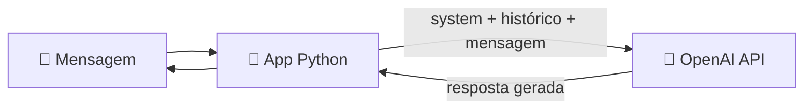

<h1 align="center">🧠 Utilizando OpenAI - Introdução</h1>

  
  
  

<h2 align="left">📌 Por que OpenAI em chatbots</h2>

Watson e Dialogflow dependem de **intents** e frases de treino. Com um **LLM** (GPT), o bot gera a resposta a partir do contexto da conversa — sem mapear cada caminho manualmente.

| | Bot por intents (Watson/Dialogflow) | Bot com LLM (OpenAI) |
| :--- | :--- | :--- |
| Construção | Intents, entities, fluxos | **Prompt** + histórico de mensagens |
| Respostas | Escritas à mão | **Geradas** pelo modelo |
| Fora do escopo | Cai no fallback | Responde (pode "alucinar") |
| Controle | Alto e previsível | Guiado por **system prompt** |

---

## 🧩 Conceitos básicos

| Conceito | Descrição |
| :--- | :--- |
| **Model** | O LLM usado (ex.: `gpt-4o-mini`) |
| **Prompt** | Texto de entrada enviado ao modelo |
| **Roles** | `system` (regras do bot), `user` (usuário), `assistant` (respostas) |
| **Token** | Pedaço de texto; base de cobrança e do limite de contexto |
| **Temperature** | Criatividade da resposta (0 = previsível, 1+ = variada) |
| **API key** | Chave secreta que autentica as chamadas |

---

## 🚀 Primeiros passos

1. Criar conta em **platform.openai.com** e adicionar créditos.
2. Em **API keys**, gerar uma chave (`sk-...`) — guardar com segurança, nunca commitar.
3. Testar prompts no **Playground** antes de programar.

---

## ✅ Resumo

- OpenAI troca intents por **prompt + histórico**.
- O **system prompt** define personalidade e limites do bot.
- Tudo começa com uma **API key** na OpenAI Platform.
