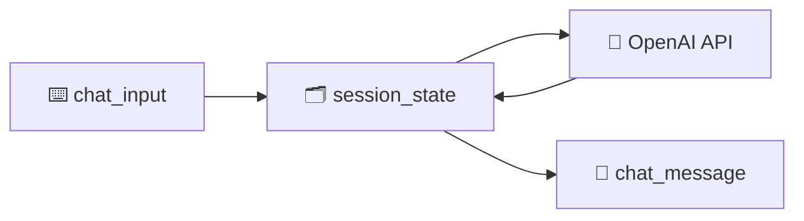

<h1 align="center">🔗 Utilizando OpenAI - Streamlit + OpenAI API</h1>

<p align="center">
  
  
  
</p>

<h2 align="left">📌 O que é o Streamlit</h2>

Biblioteca Python que transforma um script em **app web** sem HTML/CSS/JS. Cada interação do usuário **re-executa o script** de cima a baixo.

| Componente | Uso no chatbot |
| :--- | :--- |
| `st.title` | Título da página |
| `st.chat_input` | Caixa de mensagem do usuário |
| `st.chat_message` | Balão de mensagem (`user` / `assistant`) |
| `st.session_state` | Guarda o histórico entre as re-execuções |
| `st.secrets` | Lê a API key de `.streamlit/secrets.toml` |

---

## 🔑 Guardando a chave

```toml
# .streamlit/secrets.toml  (adicionar ao .gitignore)
OPENAI_API_KEY = "sk-..."
```

---

## 🤖 app.py

```python
import streamlit as st
from openai import OpenAI

st.title("🍕 Pizzaria Bot")

client = OpenAI(api_key=st.secrets["OPENAI_API_KEY"])

if "mensagens" not in st.session_state:
    st.session_state.mensagens = [
        {"role": "system", "content": "Você é um atendente de pizzaria, educado e direto."}
    ]

for msg in st.session_state.mensagens[1:]:
    with st.chat_message(msg["role"]):
        st.markdown(msg["content"])

if pergunta := st.chat_input("Digite sua mensagem"):
    st.session_state.mensagens.append({"role": "user", "content": pergunta})
    with st.chat_message("user"):
        st.markdown(pergunta)

    resposta = client.chat.completions.create(
        model="gpt-4o-mini",
        messages=st.session_state.mensagens,
    )
    texto = resposta.choices[0].message.content

    st.session_state.mensagens.append({"role": "assistant", "content": texto})
    with st.chat_message("assistant"):
        st.markdown(texto)
```

```bash
streamlit run app.py   # abre em http://localhost:8501
```



---

## ✅ Resumo

- Streamlit re-executa o script a cada interação → histórico em `st.session_state`.
- `st.chat_input` + `st.chat_message` montam a interface de chat.
- A chave fica em `secrets.toml`, fora do repositório.
