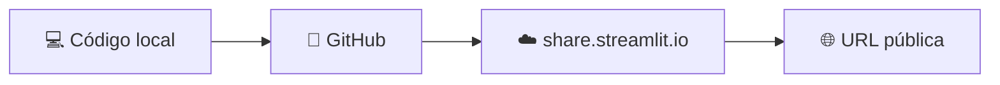

<h1 align="center">🏁 Utilizando OpenAI - Finalização</h1>

<p align="center">
  
  
  
</p>

<h2 align="left">📦 Preparando para publicar</h2>

```text
meu-chatbot/
├── app.py
├── requirements.txt        # openai, streamlit
├── .gitignore              # venv/, .streamlit/secrets.toml
└── .streamlit/
    └── secrets.toml        # só local
```

```bash
pip freeze > requirements.txt
```

---

## 🚀 Deploy no Streamlit Community Cloud



1. Subir o projeto para um repositório no **GitHub** (sem o `secrets.toml`).
2. Em **share.streamlit.io**, *New app* → escolher repositório, branch e `app.py`.
3. Em **Advanced settings → Secrets**, colar `OPENAI_API_KEY = "sk-..."`.
4. **Deploy** → o app ganha uma URL pública.

---

## 🧪 Checklist final

- [ ] System prompt define escopo e tom do bot.
- [ ] Histórico mantido em `st.session_state`.
- [ ] Chave fora do código e fora do Git.
- [ ] Limite de gastos configurado em **Billing → Limits** na OpenAI.
- [ ] Testes com perguntas fora do escopo (o bot recusa ou redireciona?).

---

## ✅ Resumo do módulo

- **Watson / Dialogflow**: bots por intents, fluxos e entities.
- **OpenAI**: bot gerado por LLM, guiado por **system prompt + histórico**.
- **Streamlit**: interface de chat em Python puro, com deploy gratuito no Community Cloud.
