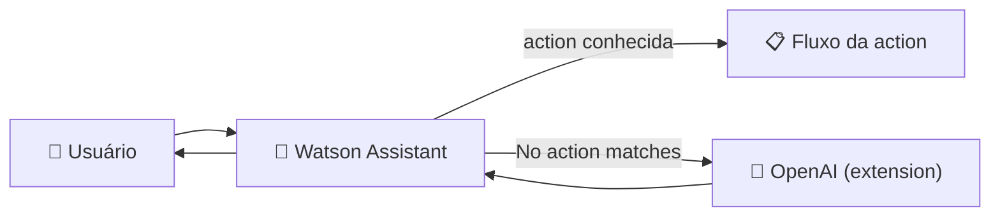

<h1 align="center">⚖️ Solução integrada - OpenAI vs Assistant</h1>

<p align="center">
  
  
  
</p>

<h2 align="left">📌 Dois jeitos de fazer um bot</h2>

| | **Watson Assistant** | **OpenAI (LLM)** |
| :--- | :--- | :--- |
| Como responde | Actions, steps e respostas escritas | Texto gerado pelo modelo |
| Controle | Total (fluxo definido) | Guiado pelo **system prompt** |
| Fora do escopo | Cai em *No action matches* | Responde qualquer coisa (se não for limitado) |
| Ponto forte | Processos: pedido, cadastro, status | Perguntas abertas e linguagem natural |
| Custo | Plano da IBM Cloud | Por token |

---

## 🤖 ChatGPT-clone com instruções

O system prompt (`instructions`) restringe o comportamento do modelo:

```python
if prompt := st.chat_input("What's up?"):
    instructions = "Você é um atendente de pizzaria. Responda apenas sobre o cardápio e pedidos."
    ...
    stream = client.chat.completions.create(
        model=st.session_state["openai_model"],
        messages=[
            {"role": "system", "content": instructions},
            {"role": "user", "content": prompt},
        ],
        stream=True,
    )
```

---

## 🔗 A ideia da solução integrada



> 💡 O Watson cuida dos **fluxos de negócio**; o que ele não sabe, ele **encaminha para o GPT**.

---

## ✅ Resumo

- Assistant = previsível; LLM = flexível.
- `instructions` como mensagem `system` delimita o escopo do GPT.
- Integrando os dois, ganha-se controle **e** flexibilidade.
