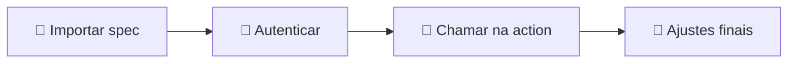

<h1 align="center">✨ Solução integrada - Introdução GenAI</h1>

  
  
  

<h2 align="left">📌 GenAI dentro do Watson</h2>

O Watson Assistant permite chamar serviços externos por meio de **Custom Extensions**: uma API descrita em **OpenAPI (JSON)** que vira um passo dentro de uma action.

| Peça | Papel |
| :--- | :--- |
| **OpenAPI spec** | Descreve o endpoint `/v1/chat/completions` da OpenAI |
| **Extension** | Conexão registrada em *Integrations → Extensions* |
| **Autenticação** | API key da OpenAI (Bearer token) |
| **Action** | Step que usa *Use an extension* e mostra a resposta |

> 💡 A IBM disponibiliza um *starter kit* com a spec da OpenAI no repositório `watson-developer-cloud/assistant-toolkit`.

---

## 🗺️ Etapas das próximas aulas

---

## ✅ Resumo

- Custom Extension = ponte entre o Watson e qualquer API REST.
- Para a OpenAI, basta a spec OpenAPI + a API key.