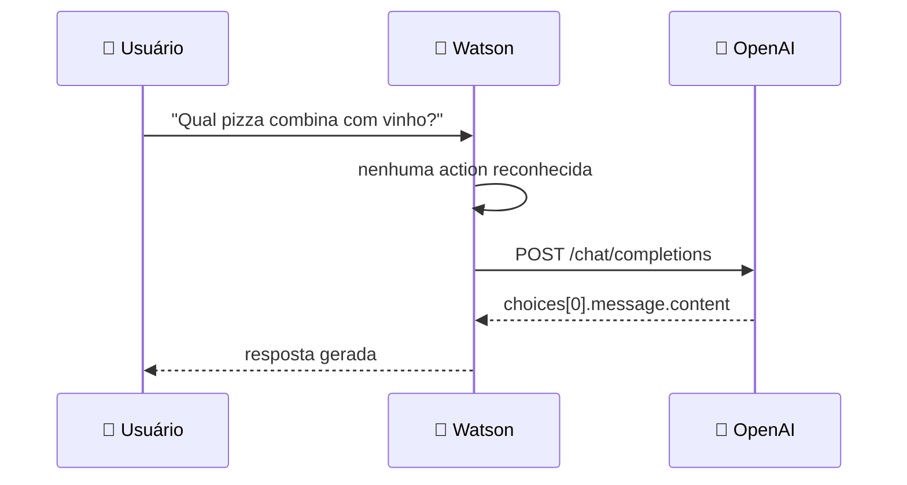

<h1 align="center">🔗 Solução integrada - Integração GenAI</h1>

<p align="center">
  
  
  
</p>

<h2 align="left">⚙️ Chamando o GPT numa action</h2>

Na action **No action matches** (ou numa action criada para isso):

1. **New step** → *And then* → **Use an extension**.
2. Extension: `OpenAI` · Operation: `Create chat completion`.
3. Parâmetros:

| Parâmetro | Valor |
| :--- | :--- |
| `model` | `gpt-4o-mini` |
| `messages[0].role` | `system` |
| `messages[0].content` | `Você é um atendente de pizzaria...` |
| `messages[1].role` | `user` |
| `messages[1].content` | variável **input.text** (o que o usuário digitou) |

4. Próximo step → resposta com a variável da extension:

```text
${step_xxx_result_1.body.choices[0].message.content}
```

---

## 🔄 Fluxo



---

## ✅ Resumo

- **Use an extension** chama a OpenAI de dentro de um step.
- A resposta é lida em `body.choices[0].message.content`.