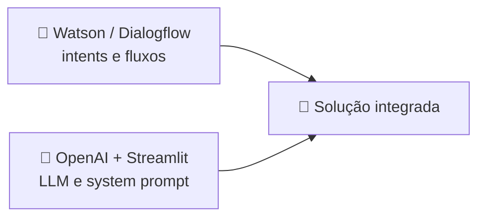

<h1 align="center">🏁 Solução integrada - Ajustes finais</h1>

  
  
  

<h2 align="left">🛠️ Ajustes</h2>

| Ajuste | Por quê |
| :--- | :--- |
| System prompt restrito | Evita respostas fora do negócio |
| `max_tokens` | Respostas curtas e custo controlado |
| `temperature` baixa (0.2–0.5) | Respostas mais consistentes |
| Condição `status == 200` | Se a API falhar, mostrar mensagem padrão |
| Mensagem de fallback | *"Não consegui responder agora, quer falar com um atendente?"* |

---

## 🧪 Testes no Preview

- [ ] Frases das actions continuam caindo no fluxo certo.
- [ ] Perguntas abertas vão para a OpenAI e voltam respondidas.
- [ ] Perguntas fora do tema são recusadas pelo system prompt.
- [ ] Erro na API (chave inválida) cai no fallback.

---

## ✅ Resumo do módulo

- **Bots baseados em regras** dão controle e previsibilidade.
- **LLMs** dão flexibilidade para perguntas abertas.
- A **solução integrada** une os dois: Watson orquestra, GPT complementa.