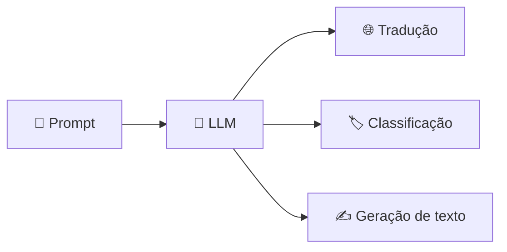

<h1 align="center">🧠 Contextualizando LLMs - O que são LLMs</h1>

  
  
  

<h2 align="left">📌 LLM — Large Language Model</h2>

Modelos de linguagem **gerais**, treinados com uma quantidade enorme de texto, capazes de entender e gerar linguagem natural.

| Termo | Significado |
| :--- | :--- |
| **Large** | Treinado com uma **vasta quantidade de dados** (e bilhões de parâmetros) |
| **Language** | Aprende **padrões linguísticos** — gramática, contexto, relações entre palavras |
| **Model** | Modelo estatístico que **prevê o próximo token** a partir do texto anterior |

---

## 🧩 O que um LLM faz

Um mesmo modelo resolve várias tarefas sem ser treinado para cada uma:

- **Tradução** entre idiomas
- **Classificação** (sentimento, categoria, intenção)
- **Geração de texto** (respostas, resumos, código)

---

## 🏢 Exemplos

| Modelo | Empresa |
| :--- | :--- |
| **ChatGPT / GPT** | OpenAI |
| **LLaMA** | Meta |
| **Gemini** | Google |

---

## ✅ Resumo

- LLM = modelo **geral**, treinado em muitos dados, que aprende **padrões da linguagem**.
- Faz várias tarefas (traduzir, classificar, gerar) a partir de um **prompt**.
- Base do módulo: entender o que o LLM faz bem para depois ver **suas limitações** e como o **RAG** ajuda.
