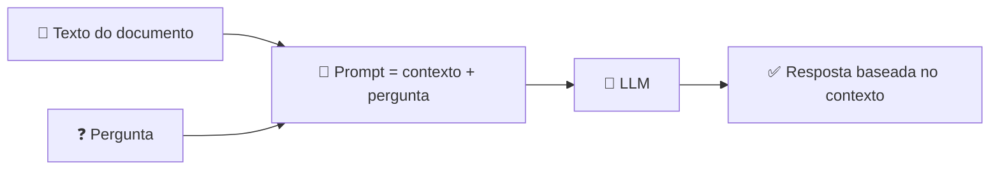

<h1 align="center">📎 Contextualizando LLMs - Utilizando LLMs com contexto</h1>

<p align="center">
  
  
  
</p>

<h2 align="left">📌 Colocar a informação dentro do prompt</h2>

Se o modelo não conhece o dado, basta **enviá-lo junto com a pergunta**. O LLM passa a responder com base no texto fornecido (*in-context learning*).



---

## 🧩 Exemplo de prompt

```text
Responda APENAS com base no contexto abaixo.
Se a resposta não estiver no contexto, diga "não encontrei no documento".

Contexto:
"""
Política de reembolso: o cliente pode solicitar reembolso em até 7 dias corridos
após a compra, mediante apresentação da nota fiscal.
"""

Pergunta: Qual o prazo de reembolso?
```

Resposta esperada: **7 dias corridos, com nota fiscal** — sem alucinação.

| Vantagem | Por quê |
| :--- | :--- |
| Dados atualizados/privados | O contexto vem de fora do modelo |
| Menos alucinação | Instrução limita a resposta ao texto |
| Sem re-treinar | Não precisa de fine-tuning |

---

## ✅ Resumo

- Dar **contexto no prompt** resolve a falta de conhecimento do LLM.
- A instrução "responda só com base no contexto" reduz alucinação.
- Funciona bem… enquanto o contexto é **pequeno** → próxima aula.
