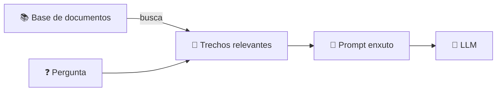

<h1 align="center">🚧 Contextualizando LLMs - Limitações do Prompt com Contexto</h1>

  
  
  

<h2 align="left">📌 E se o documento for grande?</h2>

Colar um PDF inteiro (ou vários) no prompt não escala.

| Limitação | Detalhe |
| :--- | :--- |
| **Janela de contexto** | Todo modelo tem um limite de **tokens** por chamada |
| **Custo** | Cobrança por token → enviar o documento inteiro a cada pergunta é caro |
| **Latência** | Prompts enormes demoram mais para processar |
| **Perda de foco** | Com muito texto, o modelo pode ignorar a parte relevante (*lost in the middle*) |
| **Manual** | Alguém precisa escolher e colar o trecho certo |

---

## 💡 A ideia que leva ao RAG

Em vez de enviar **tudo**, enviar **só os trechos relevantes** para a pergunta — buscados automaticamente.

---

## ✅ Resumo

- Prompt com contexto é limitado por **tokens, custo e foco**.
- A solução é **recuperar** apenas o que importa antes de perguntar ao LLM.
- Isso é o **RAG** → próximo bloco.
