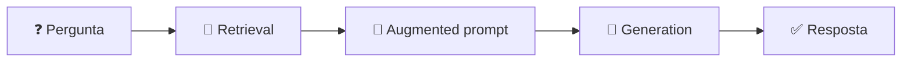

<h1 align="center">🔎 Introdução ao RAG - Introdução ao RAG</h1>

  
  
  

<h2 align="left">📌 RAG — Retrieval-Augmented Generation</h2>

Técnica que **recupera** informações de uma base de conhecimento e as usa para **aumentar** o prompt antes de o LLM **gerar** a resposta.

| Letra | Significado | Papel |
| :--- | :--- | :--- |
| **R** | Retrieval | Buscar os trechos relevantes nos documentos |
| **A** | Augmented | Enriquecer o prompt com esses trechos |
| **G** | Generation | O LLM gera a resposta usando o contexto |

---

## 🧩 Por que usar

- Responde sobre **dados privados e atualizados** sem re-treinar o modelo.
- Reduz **alucinação** — a resposta se apoia em trechos reais.
- Permite **citar a fonte** (página, documento).
- Mais barato e rápido que **fine-tuning** para dar conhecimento novo.

| | Fine-tuning | RAG |
| :--- | :--- | :--- |
| Atualizar conhecimento | Re-treinar | Atualizar a base de documentos |
| Custo | Alto | Baixo |
| Rastreabilidade | Baixa | Alta (mostra os trechos usados) |

---

## ✅ Resumo

- RAG = **buscar** + **aumentar o prompt** + **gerar**.
- Resolve as limitações do LLM e do prompt com contexto manual.
