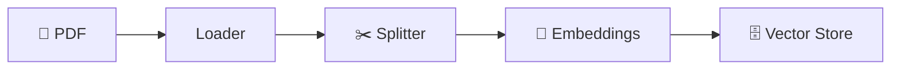

<h1 align="center">🧱 Introdução ao RAG - Componentes do RAG - parte 1</h1>

<p align="center">
  
  
  
</p>

<h2 align="left">📌 Etapa de ingestão (preparar a base)</h2>

Antes de responder perguntas, os documentos precisam ser preparados.

| Componente | Função |
| :--- | :--- |
| **Document Loader** | Lê a fonte (PDF, site, banco) e extrai o texto |
| **Text Splitter** | Quebra o texto em pedaços menores — os **chunks** |
| **Embeddings** | Converte cada chunk em um **vetor** numérico que representa seu significado |
| **Vector Store** | Banco que guarda os vetores e permite busca por similaridade |



---

## 🧩 Chunks

- Pedaços pequenos = busca mais **precisa** e prompt mais **enxuto**.
- **chunk_size**: tamanho de cada pedaço (ex.: 1000 caracteres).
- **chunk_overlap**: sobreposição entre pedaços (ex.: 200) para não cortar uma ideia no meio.

## 🔢 Embeddings

Textos com significado parecido geram vetores **próximos** no espaço.

```text
"prazo de reembolso"     → [0.12, -0.48, 0.91, ...]
"devolução do dinheiro"  → [0.10, -0.45, 0.88, ...]   ← próximos
"receita de bolo"        → [-0.77, 0.30, -0.05, ...]  ← distante
```

---

## ✅ Resumo

- Ingestão: **carregar → dividir → vetorizar → armazenar**.
- Chunks + embeddings tornam possível buscar por **significado**, não só por palavra-chave.
