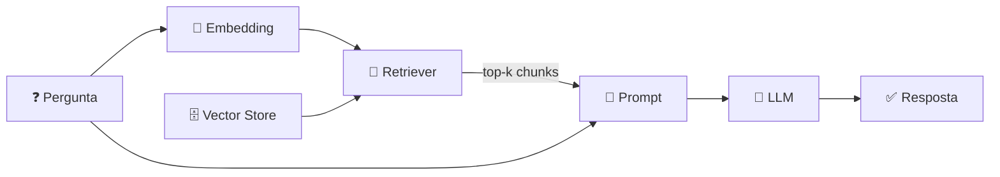

<h1 align="center">🧱 Introdução ao RAG - Componentes do RAG - parte 2</h1>

  
  
  

<h2 align="left">📌 Etapa de consulta (responder perguntas)</h2>

| Componente | Função |
| :--- | :--- |
| **Retriever** | Transforma a pergunta em embedding e busca os **k** chunks mais similares |
| **Prompt Template** | Monta o prompt com instrução + chunks recuperados + pergunta |
| **LLM** | Gera a resposta a partir do prompt aumentado |
| **Chain** | Liga tudo em um fluxo único: pergunta → retriever → prompt → LLM → resposta |

---

## 🧩 Similaridade

A busca compara o vetor da pergunta com os vetores dos chunks (ex.: **similaridade de cosseno**) e devolve os mais próximos.

| Parâmetro | Efeito |
| :--- | :--- |
| `k` baixo | Contexto mais focado, risco de faltar informação |
| `k` alto | Mais contexto, mais tokens e mais ruído |

---

## ✅ Resumo

- Consulta: **pergunta → busca → prompt aumentado → LLM**.
- O **retriever** é o "R" do RAG; o **LLM** é o "G".
