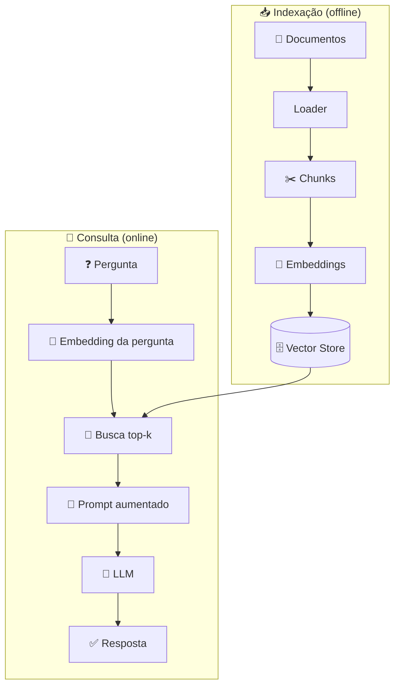

<h1 align="center">🏗️ Arquitetura RAG - Arquitetura RAG</h1>

  
  
  

<h2 align="left">📌 Visão geral</h2>

A arquitetura RAG tem **dois fluxos**: um que roda **uma vez** (ou quando os documentos mudam) e outro que roda **a cada pergunta**.

| Fluxo | Quando roda | Saída |
| :--- | :--- | :--- |
| **Indexação** | Ao adicionar/alterar documentos | Vetores salvos no banco |
| **Consulta** | A cada pergunta do usuário | Resposta fundamentada |

---

## 🧩 Pontos de decisão

| Decisão | Opções comuns |
| :--- | :--- |
| Loader | PyPDF, Unstructured, web loaders |
| Chunking | Tamanho fixo, recursivo, por seção |
| Modelo de embedding | `text-embedding-3-small`, modelos open source |
| Vector store | Chroma, FAISS, Pinecone, pgvector |
| LLM | GPT, LLaMA, Gemini |

> ⚠️ O mesmo **modelo de embedding** deve ser usado na indexação e na consulta.

---

## ✅ Resumo

- RAG = **indexação** (prepara a base) + **consulta** (responde).
- Cada etapa tem escolhas que afetam qualidade, custo e velocidade.
