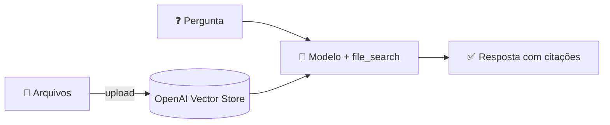

<h1 align="center">🤖 Arquitetura RAG - RAG dentro da OpenAI</h1>

<p align="center">
  
  
  
</p>

<h2 align="left">📌 RAG gerenciado</h2>

A OpenAI oferece RAG pronto: você envia os arquivos e ela cuida de **chunking, embeddings, armazenamento e busca**.

| Onde | Como |
| :--- | :--- |
| **ChatGPT** | Anexar PDF na conversa ou criar um **GPT personalizado** com arquivos de conhecimento |
| **API** | Ferramenta **File Search** com um **Vector Store** da OpenAI |



---

## 🧩 Exemplo (API)

```python
from openai import OpenAI

client = OpenAI()

vs = client.vector_stores.create(name="documentos")
client.vector_stores.files.upload_and_poll(vector_store_id=vs.id, file=open("documento.pdf", "rb"))

resposta = client.responses.create(
    model="gpt-4o-mini",
    input="Qual o prazo de reembolso?",
    tools=[{"type": "file_search", "vector_store_ids": [vs.id]}],
)
print(resposta.output_text)
```

| | RAG da OpenAI | RAG próprio (LangChain) |
| :--- | :--- | :--- |
| Esforço | Baixo | Maior |
| Controle (chunking, prompt, busca) | Pouco | Total |
| Dados | Ficam na OpenAI | Onde você escolher |
| Troca de LLM | Preso à OpenAI | Livre |

---

## ✅ Resumo

- OpenAI entrega RAG **pronto** via ChatGPT ou **File Search**.
- Ótimo para começar; construir o próprio dá **controle** → resto do módulo.
