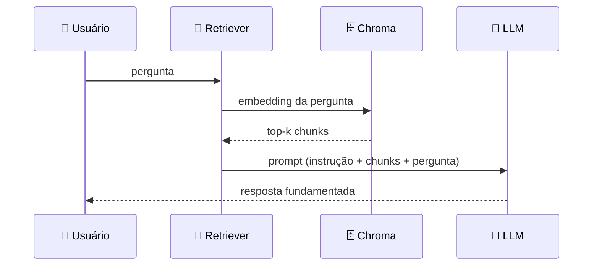

<h1 align="center">🔬 Arquitetura RAG - Detalhando a Arquitetura RAG</h1>

<p align="center">
  
  
  
</p>

<h2 align="left">📌 Do PDF à resposta, passo a passo</h2>

| # | Etapa | Ferramenta no projeto |
| :---: | :--- | :--- |
| 1 | Carregar o PDF | `PyPDFLoader` |
| 2 | Dividir em chunks | `RecursiveCharacterTextSplitter` |
| 3 | Gerar embeddings | `OpenAIEmbeddings` |
| 4 | Salvar no banco vetorial | `Chroma` |
| 5 | Buscar chunks relevantes | `vectorstore.as_retriever()` |
| 6 | Montar prompt com contexto | `ChatPromptTemplate` |
| 7 | Gerar resposta | `ChatOpenAI` |
| 8 | Encadear tudo | **chain** (LCEL `\|`) |



---

## 🧩 Prompt típico de RAG

```text
Você é um assistente que responde perguntas sobre o documento.
Use apenas o contexto abaixo. Se não souber, diga que não encontrou.

Contexto:
{context}

Pergunta: {question}
```

---

## ✅ Resumo

- 8 etapas, cada uma mapeada para um componente do **LangChain**.
- Próximo passo: preparar o **ambiente** e começar o código.
