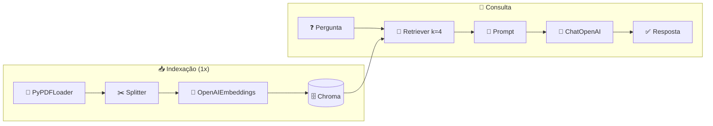

<h1 align="center">🏁 Finalizando - Finalizando solução RAG - Recapitulação</h1>

<p align="center">
  
  
  
</p>

<h2 align="left">📌 Fluxo completo</h2>



| Aula | Etapa | Função |
| :---: | :--- | :--- |
| 172 | Carregar PDF | `carregar_pdf` |
| 173 | Chunks | `separar_chunks` |
| 174 | Banco vetorial | `salvar_vetores` |
| 175 | Retriever + chain | `criar_chain` |
| 176 | Execução | `preparar_base` / `executar` |
| 177 | Debug da busca | `chunks_relevantes` |

---

## ▶️ Rodar

```bash
# coloque o PDF como documento.pdf nesta pasta
python "178-Finalizando - Finalizando solução RAG - Recapitulação.py"
```

---

## ✅ Resumo do módulo

- LLMs não conhecem dados privados/atuais e **alucinam**; colar tudo no prompt não escala.
- **RAG** busca só os trechos relevantes e os injeta no prompt.
- Com **LangChain + Chroma + OpenAI**: PDF → chunks → embeddings → busca → resposta fundamentada.
- Próximo módulo: **RAG Code Review**.
